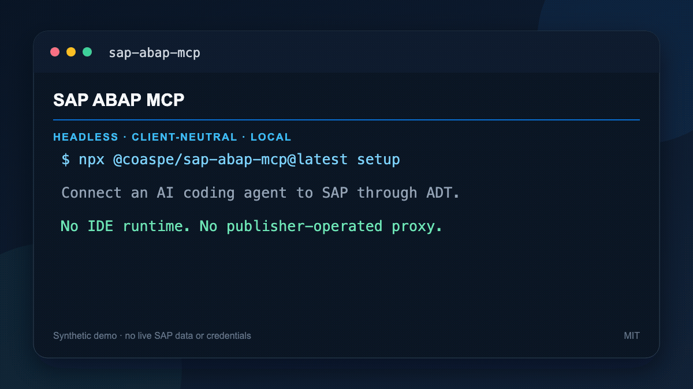

# sap-abap-mcp

[](https://www.npmjs.com/package/@coaspe/sap-abap-mcp)
[](https://www.npmjs.com/package/@coaspe/sap-abap-mcp)
[](https://registry.modelcontextprotocol.io/v0.1/servers?search=io.github.Coaspe/sap-abap-mcp)
[](LICENSE)

**The headless, client-neutral, governance-first MCP server for SAP ABAP
development across multiple systems.**

SAP ABAP MCP lets Codex, Claude, and other local MCP hosts work with SAP ABAP
through ABAP Development Tools (ADT) HTTP services. It can inspect and edit
source, run quality checks, manage transports, use abapGit and the RAP
generator, inspect runtime data, compare systems, and perform guarded
refactorings without an IDE runtime, SAP GUI, or an ABAP FS virtual workspace.

## Why this server

SAP now provides an [official ADT MCP
Server](https://help.sap.com/docs/abap-cloud/abap-development-tools-user-guide/configuring-adt-mcp-server-ed94320814734d97801f51a5b6deb802)
inside its ADT clients. This project serves a different operating model:
headless automation from any supported local MCP host.

| | SAP ABAP MCP | SAP ADT MCP Server |
|---|---|---|
| Runtime | Independent Node.js process: local `stdio`, or self-hosted Streamable HTTP for a shared instance | Local HTTP server hosted by an ADT client |
| Agent hosts | Codex, Claude, and other MCP clients, locally or over HTTP | MCP hosts configured against the running ADT server |
| SAP sessions | Multiple named profiles in one process | SAP projects and sessions managed by ADT |
| Guardrails | Production profiles are read-only; writes support package restrictions and explicit confirmations; HTTP mode adds API key roles, rate limits, and a structured audit log | Governed by the installed ADT version, SAP authorizations, and client configuration |
| Assurance | Read-only transport assessment with JSON, SARIF, and JUnit evidence | SAP-provided in-IDE development workflows |
| Verification | Separates implemented, discovered, authorized, and live-verified capabilities | SAP product support and release documentation |

This is a deployment-model comparison, not a capability benchmark or a claim
of SAP endorsement. Official behavior varies by ADT and SAP backend release.

## 90-second workflow



The animation contains synthetic object and transport names and no live SAP
data. See the [accessible transcript and exact workflow](docs/demo-script.md).

## Quick start

You need Node.js 20 or later, network or VPN access to SAP, and an SAP HTTPS URL, three-digit client number, username, and ADT Basic Auth permission.

### 1. Configure SAP

Windows:

```powershell
npx.cmd @coaspe/sap-abap-mcp@latest setup
```

macOS or Linux:

```bash
npx @coaspe/sap-abap-mcp@latest setup
```

The wizard calls the local connection alias `Server name` and the endpoint `SAP URL`. Windows and macOS validate SAP before saving and protect the password with DPAPI or Keychain. Linux saves only non-secret settings and prints the password environment-variable commands to run before starting the MCP client.

### 2. Register the MCP server

After setup, run the command for your client on Windows:

```powershell
codex mcp add sap-abap -- npx.cmd --yes --prefer-online @coaspe/sap-abap-mcp@latest serve --profile DEV100
claude mcp add --transport stdio --scope user sap-abap -- npx.cmd --yes --prefer-online @coaspe/sap-abap-mcp@latest serve --profile DEV100
```

On macOS or Linux, replace `npx.cmd` with `npx`:

```bash
codex mcp add sap-abap -- npx --yes --prefer-online @coaspe/sap-abap-mcp@latest serve --profile DEV100
claude mcp add --transport stdio --scope user sap-abap -- npx --yes --prefer-online @coaspe/sap-abap-mcp@latest serve --profile DEV100
```

Replace `DEV100` with the Server name selected in the wizard. Restart the client, then use `codex mcp list`, `claude mcp get sap-abap`, or `/mcp` to confirm that the process starts. The completed wizard already performs live SAP verification; `/mcp` alone does not prove that SAP authentication succeeded.

Prefer a plugin install? Follow [Claude Code and Codex plugin marketplaces](#claude-code-and-codex-plugin-marketplaces); the included setup skill guides the same local wizard without putting the SAP password in chat. See the detailed [Windows](#detailed-setup-on-windows), [macOS](#detailed-setup-on-macos), and [Linux](#linux-and-containers) sections for platform-specific behavior and server management.

## Community and adoption

- Read the public [roadmap](ROADMAP.md).
- Run or implement the open [SAP ABAP MCP compatibility profile](spec/README.md).
- Add an opt-in, sanitized entry to [ADOPTERS.md](ADOPTERS.md).
- Use [GitHub Discussions](https://github.com/Coaspe/sap-abap-mcp/discussions)
  for implementation questions, compatibility evidence, and RFCs.

Need help evaluating it in a controlled SAP DEV/QAS environment? See the
[professional services and five-day pilot](SERVICES.md). Do not include SAP
credentials, source code, hosts, tokens, or other confidential information in
a public issue or discussion.

### Current v1 surface

The unversioned `serve` command maps the 53 legacy capabilities to 120
action-free v1 tools and seven Resources, split across bounded `core`, `write`,
`analysis`, `debug`, `operations`, and `artifacts` toolsets. Omitting
`--toolsets` selects all 120 tools. Use `--api-version v0` only for legacy
client compatibility, or select toolsets explicitly when a host should
advertise fewer schemas.
Normal clients should omit both `--api-version` and `--toolsets`.

| Invocation | Advertised surface |
|---|---|
| `serve --profile DEV100` | Current v1, all 120 tools and seven Resources |
| `serve --profile DEV100 --preset compact` | Token-efficient v1, 12 everyday read/inspect tools |
| `serve --profile DEV100 --toolsets core,analysis` | Selected v1 toolsets only |
| `serve --profile DEV100 --api-version v0` | Legacy 53-tool compatibility surface |

See the
[v1 migration guide](docs/v1-migration.md) for contracts, Resources, and the
separate live-SAP verification boundary.

## Live SAP evidence

Capabilities are reported as `unverified` until they succeed against a live
connection. [`docs/live-sap-evidence.md`](docs/live-sap-evidence.md) records the
current sanitized results — no credentials, no customer source, no host names.

| Area | ECC 758 | S/4HANA 758 |
|---|---|---|
| `$TMP`-scoped v1 surface | 87 passed, 11 unsupported, 0 failed | 93 passed, 2 unsupported, 0 failed |
| Self-hosted HTTP mode, roles, and audit | 13 of 13 passed | not run |
| CI assurance gate and its artifacts | 7 of 7 passed | not run |

200 live checks in total: 180 tool-surface checks across two systems, plus 20
transport and CI checks on one. The tool-surface count counts each capability once
per system, because release coverage is the claim; it is not 180 distinct
capabilities.

On S/4HANA this includes the complete class-runner and debugger chain: a `$TMP`
class runner executed, a breakpoint on its own source suspended it, and the
attached debugger returned a 13-frame stack, variables, an evaluated expression,
and a completed step. On ECC the ADT class-run endpoint rejects the same class, so
the attached debugger is unreachable there; that difference accounts for the nine
extra `unsupported` results and is documented with its exact SAP message.

Reproduce the tool-surface run against your own development system:

```bash
npm run evidence:live -- DEV100
```

The harness creates exactly one class in the local package `$TMP` under a
run-unique name, treats it as owned only after a create receipt and an immediate
exact read-back agree, refuses in code to mutate anything else, and deletes it
again. Existing objects are only ever read. The two `unsupported` results are
missing SAP-side prerequisites — the ABAP REPL and the abapGit ADT backend — not
defects.

## ABAP FS parity status

The pinned ABAP FS 2.6.5 source exposes 43 MCP tools. This server provides a strict-compatible subset of 42; the omitted tool is `manage_subagents`, which depends on the VS Code agent host. With 10 headless feature extensions and `read_deferred_result`, this server advertises 53 tools in total.

The development surface supports create-time source for BDEFs, classes, interfaces, programs/includes, CDS/DCL/metadata extensions, and service definitions, plus structured DDIC reads/writes, one-request batch activation, class and executable-program profiling, the ABAP FS REPL contract, detailed semantic and enhancement inspection, paged repository-child discovery, bounded runtime feeds, and an opt-in classic-object bridge. SAP-dependent capabilities remain `unverified` until they succeed against the selected live connection; call `get_sap_capabilities` for per-connection evidence.

Snippet execution requires `ZCL_ABAP_REPL` and an active SICF service at `/sap/bc/z_abap_repl`. Executable programs use the ADT program-run endpoint through a confirmed one-use plan and request only a bounded server-time profile.

## What it supports

The server provides all 42 strict-compatible headless tools from the pinned ABAP FS baseline, ten grouped feature extensions, and one infrastructure tool for continuing oversized results.

| Area | Capabilities |
|---|---|
| Connections | Multiple SAP profiles, Basic Auth, OAuth client credentials, browser OAuth Authorization Code with PKCE, request-scoped bearer passthrough, lazy login, system metadata, ADT discovery export |
| Repository reads | Search, metadata, structured DDIC properties, paged package/program/function-group children, source ranges, batch reads, URI reads, source search, enhancement implementations and elements |
| Semantic services | Completion details, definition lookup, documentation, type hierarchy, components, quick-fix discovery, SAP formatter preview |
| Source writes | Exact source replacement, typed DDIC updates, create-time source for textual ADT object types, syntax diagnostics, single- and one-request batch activation, text elements |
| Refactoring | Rename, package move, extract method, quick-fix application, formatting, deletion |
| Quality | ABAP Unit, ATC, diagnostics, test-include creation |
| Transports | List, details, objects, read-only release assessment, JSON/SARIF/JUnit evidence, compare, create, release, delete, owner/user management, object resolution |
| Versions | Active revision history, revision comparison, inactive source, guarded revision restore |
| abapGit | Repository list, remote information, create, pull, unlink, stage, push, check, branch switch (requires the abapGit ADT backend on the SAP system) |
| RAP | Availability, paged schema, defaults, validation, preview, generation, service binding details, and OData V2/V4 publication and unpublication |
| Runtime | Guarded class/program execution with bounded aggregate profiling, fixed-contract ABAP REPL execution, debugger, breakpoints, stack, variables, dumps, traces, Gateway/system feeds, heartbeat checks |
| Cross-system | Source comparison across configured SAP systems |
| Dependency analysis | Bounded where-used dependency graph |
| SAP GUI integration | Validated WebGUI transaction URL generation and optional local launch |
| Classic objects | Opt-in, same-origin Screen/Dynpro and full GUI Status bridge with confirmed writes |
| Data | Read-only ADT SQL queries with bounded or file-based output |
| Artifacts | Mermaid validation/viewer and DOCX test documentation |

The ten grouped extension tools are:

- `inspect_abap_code`
- `refactor_abap_code`
- `manage_abapgit`
- `manage_rap_generator`
- `manage_abap_versions`
- `compare_abap_systems`
- `get_abap_dependency_graph`
- `run_sap_transaction`
- `get_sap_capabilities`
- `run_abap_application`

Grouping related actions keeps the tool-schema footprint lower than exposing every operation as a separate MCP tool.
`read_deferred_result` is the additional infrastructure tool; it reads the remaining UTF-8 chunks of a large result without repeating the SAP operation.

See [advanced ABAP workflows](docs/advanced-workflows.md) for enhancement,
behavior implementation, CDS Unit, local test include, and program profiling
recipes. See the [classic-object bridge guide](docs/classic-bridge.md) before
enabling Screen/Dynpro or GUI Status access.

## Transport change assurance

`manage_transport_requests` keeps transport review inside the existing grouped tool. Its read-only `assess_transport` action can run ATC and ABAP Unit for each supported transport object, optionally compare the same objects with a target connection, and emit JSON, SARIF 2.1.0, and JUnit XML reports.

The returned gate is `passed`, `failed`, or `incomplete`. Truncated object coverage, truncated ATC findings, failed check execution, empty transports, and classes without discoverable tests prevent a pass. A target-system difference is recorded as landscape evidence rather than automatically treated as a failure. Assessment never releases the transport; `release_transport` remains a separate confirmed mutation.

The plugin includes `sap-abap-change-assurance` for this workflow. In Claude Code run `/sap-abap-mcp:sap-abap-change-assurance`; in Codex ask to use `$sap-abap-change-assurance`.

### Gate a pipeline without an MCP host

Change assurance does not require an AI agent. The `assure` command runs the same
read-only assessment directly and turns the gate into an exit code:

```bash
npx @coaspe/sap-abap-mcp@latest assure DEV100 --transport DEVK900123 \
  --checks atc,unit_tests --formats json,sarif,junit \
  --report-directory ./reports
```

| Exit code | Gate | Meaning |
|---|---|---|
| 0 | `passed` | Every assessed object passed every requested check |
| 1 | `failed` | A check produced a definite failure |
| 2 | `incomplete` | Safety could not be proven — truncated coverage, a check that could not run, an empty transport, or a class with no discoverable tests |

`incomplete` blocks by default. Pass `--fail-on failed` when only definite
failures should stop a build. `assure` never releases or modifies the transport.

### GitHub Action

[`action.yml`](action.yml) wraps the same command and uploads SARIF to GitHub code
scanning, so ABAP findings appear next to the rest of a repository's security
results:

```yaml
- uses: Coaspe/sap-abap-mcp@v1
  id: assurance
  with:
    sap-url: ${{ secrets.SAP_URL }}
    sap-client: "100"
    sap-username: ${{ secrets.SAP_USERNAME }}
    sap-password: ${{ secrets.SAP_PASSWORD }}
    transport: ${{ inputs.transport }}
    checks: atc,unit_tests

- uses: github/codeql-action/upload-sarif@v3
  if: always()
  with:
    sarif_file: ${{ steps.assurance.outputs.report-sarif }}
```

The action outputs `gate`, `report-json`, `report-sarif`, and `report-junit`, and
writes a job summary. The SAP password is passed only through a
profile-specific environment variable, never as a command argument, so it does
not appear in a process list or a command echo. The runner needs network or VPN
access to SAP.

## MCP directories and registries

The canonical registry identity is `io.github.Coaspe/sap-abap-mcp`, defined in [`server.json`](server.json). Directory installs must run this package as a local `stdio` server; SAP profiles and credentials stay on the user's machine and are never hosted by a registry.

Before the first SAP-facing request, create and verify at least one local SAP profile using the commands in [Quick start](#quick-start) or [`llms-install.md`](llms-install.md). The Claude plugin may start successfully without a profile; after installation, run `/sap-abap-mcp:sap-abap-setup` to complete local SAP setup. A generic registry launch runs `@coaspe/sap-abap-mcp` with the `serve` argument and exposes all locally configured profiles; every SAP-facing tool still requires an explicit `connectionId`.

Registry publication does not change the live-evidence boundary. SAP-dependent development-parity capabilities remain `unverified` until they succeed against the selected live connection.

The public [Smithery listing](https://smithery.ai/servers/aspalt85/sap-abap-mcp)
installs the validated local MCPB bundle. Its current catalog contains 120
tools and seven Resources and is synchronized from the runtime before
publication.

The public [LobeHub listing](https://lobehub.com/mcp/coaspe-sap-abap-mcp)
uses the owner-validated [`lhm.plugin.json`](lhm.plugin.json) manifest. The
current listing advertises the same default 120 tools and seven Resources.

## Privacy Policy

SAP ABAP MCP runs locally and does not send SAP profiles, credentials, source code, or tool results to a publisher-operated service. It communicates only with destinations selected by the user, including the configured SAP system and the user's MCP host. See the complete [`PRIVACY.md`](PRIVACY.md) and [`TERMS.md`](TERMS.md).

### Claude Code and Codex plugin marketplaces

This repository is also a dual-compatible plugin marketplace. The plugin starts the same npm `latest` package as a local `stdio` process, so SAP profiles, credentials, and ADT traffic stay on the user's computer. Profiles are user-scoped outside the plugin cache and survive plugin updates.

Claude Code:

```text
/plugin marketplace add Coaspe/sap-abap-mcp
/plugin install sap-abap-mcp@coaspe-sap
/reload-plugins
```

Run the namespaced setup skill after reloading:

```text
/sap-abap-mcp:sap-abap-setup
```

The skill reuses an existing profile or guides profile creation, local password entry, and live ADT verification. Use `/mcp` to confirm that the `sap-abap` process is connected, but do not treat that status as proof that an SAP profile is authenticated; the setup skill verifies SAP with `doctor`.

Codex:

```bash
codex plugin marketplace add Coaspe/sap-abap-mcp
```

Then install **SAP ABAP MCP** from the `Coaspe SAP Developer Tools` marketplace in the Codex app and start a new task. Ask Codex to set up SAP ABAP MCP; the included `sap-abap-setup` skill keeps passwords out of chat and guides profile creation, authentication, and live ADT verification.

The plugin also includes `sap-abap-change-assurance`, which assesses an existing transport without releasing it and returns CI-native evidence paths.

## OAuth client credentials

The interactive `setup` wizard remains the Basic Auth path. OAuth client credentials are an explicit advanced profile type and do not change the defaults for newly created profiles. Create and verify one on Windows or macOS with:

```bash
npx @coaspe/sap-abap-mcp@latest profile add BTP100 \
  --url https://abap.example.com --client 100 \
  --auth-type oauth-client-credentials \
  --token-url https://auth.example.com/oauth/token \
  --client-id mcp-client --scope "abap.read abap.write" --login
```

The hidden prompt requests the OAuth client secret. The profile file stores the token URL, client ID, and optional scope, but never the client secret or access token. The token endpoint must use HTTPS and must not contain embedded credentials, query parameters, or a fragment. The client uses HTTP Basic client authentication, requires a Bearer token with a positive `expires_in`, and recreates the ADT client before the cached token expires because `abap-adt-api` 8.4.1 memoizes a bearer fetch.

For automation, pipe the client secret and add `--password-stdin`. On Linux, create the profile without `--login`, place the client secret in the printed profile-specific `SAP_ABAP_MCP_PASSWORD_<PROFILE>` environment variable, and start the MCP process from that environment. The variable name is retained for backward compatibility even when its value is an OAuth client secret.

Browser OAuth Authorization Code profiles are also available for identity
providers that support a loopback redirect URI and S256 PKCE:

```bash
npx @coaspe/sap-abap-mcp@latest profile add DEV100 \
  --url https://sap.example.com --client 100 \
  --auth-type oauth-authorization-code \
  --authorization-url https://login.example.com/oauth2/authorize \
  --token-url https://login.example.com/oauth2/token \
  --client-id mcp-public-client --scope "openid abap" --login
```

The command opens the system browser, listens only on a random loopback port,
validates OAuth `state`, exchanges the code with PKCE, and stores the resulting
credential in Keychain or DPAPI. Refresh-token rotation is persisted. Browser
OAuth login is therefore available on macOS and Windows; Linux's environment-
only secret store cannot safely persist or rotate this credential.

Client certificates, Kerberos, and user/password OAuth grants remain
unsupported. OAuth behavior is still live-unverified for a particular SAP
system until `doctor` succeeds there.

### SAP BTP ABAP environment service keys

A service key downloaded from an ABAP environment service instance already
contains the endpoint, client id, and client secret, so it can be imported
directly:

```bash
npx @coaspe/sap-abap-mcp@latest profile add BTP100 --service-key ./service-key.json
```

The command reads `url` for the ABAP endpoint, composes the token endpoint from
`uaa.url` (or uses an explicit `uaa.tokenurl` when the key provides one), sets SAP
client `100`, verifies the credentials against SAP, and stores the client secret
in the protected credential store. The secret is never typed into a terminal or
passed as a command argument.

**Delete the service key file afterwards.** BTP delivers it with the client
secret in plain text, and importing it does not remove that copy.

Service keys that use X.509 client certificates instead of a client secret are
rejected with `SERVICE_KEY_CERTIFICATE_UNSUPPORTED` rather than producing a
profile that could never authenticate.

## SAP data-query policy

Direct SAP table queries are disabled for every new profile. Enable them only on a reviewed development or quality profile:

```bash
npx @coaspe/sap-abap-mcp@latest profile add DEV100 \
  --url https://sap.example.com --client 100 --username DEVELOPER \
  --environment development --allow-data-queries
```

Production profiles cannot enable the capability. Read-only SQL validation still applies, and a second policy layer blocks credential, banking, identity, payroll, and tax tables. Business-document tables such as `VBAK`, `VBAP`, `BKPF`, `BSEG`, and `ACDOCA` require `acknowledgeRisk=true` on the individual `sap.data.query`, `sap.data.export`, or `execute_data_query` call. Dynamic table sources are refused because they cannot be inspected before execution. SQL text is redacted even when audit argument capture is enabled.

This policy applies only to caller-supplied SQL sent to SAP. Processing caller-supplied structured data, reading a cached data view, and bounded internal metadata checks used by connection diagnostics do not require the opt-in.

## Prerequisites

Ask your SAP administrator for:

- The SAP HTTPS base URL, for example `https://sap-dev.company.com`
- The three-digit SAP client number
- Your SAP user name
- ADT development permissions required by the operations you intend to use
- Confirmation that `/sap/bc/adt` and Basic Auth are enabled

Your machine needs:

- Node.js 20 or later
- Codex or Claude Code
- Network or VPN access to SAP
- npm registry access to install the public package

Verify Node.js first:

```powershell
node --version
```

## Detailed setup on Windows

### 1. Run interactive setup

```powershell
npx.cmd @coaspe/sap-abap-mcp@latest setup
```

The first run may ask whether npm may download the package; enter `y` to continue. The setup wizard collects the SAP URL, client, username, environment, and optional writable-package restriction. `Server name` is the local name used later as `connectionId`, for example `DEV100`. Keep production servers classified as `production`; they are read-only even if the package restriction is empty.

When `SAP password:` appears, enter the password and press Enter; the input remains hidden. The server configuration and password are stored only after the MCP validates the credentials against SAP. Windows protects the password with DPAPI and never writes it to the profile file.

The setup command is one line in both PowerShell and Command Prompt. For advanced multiline commands, PowerShell continues a line with a backtick (`` ` ``), while Command Prompt (`cmd.exe`) uses a caret (`^`); do not mix them.

### 2. Verify ADT connectivity

```powershell
npx.cmd --yes --prefer-online @coaspe/sap-abap-mcp@latest doctor DEV100
```

A completed setup already performs this live check. Run `doctor` again whenever you want to recheck ADT connectivity; a successful response contains `"ok": true`.

### 3. Register the MCP server

Codex CLI:

```powershell
codex mcp add sap-abap -- npx.cmd --yes --prefer-online @coaspe/sap-abap-mcp@latest serve --profile DEV100
```

Claude Code:

```powershell
claude mcp add --transport stdio --scope user sap-abap -- npx.cmd --yes --prefer-online @coaspe/sap-abap-mcp@latest serve --profile DEV100
```

Restart the client after registration. Use `codex mcp list`, `claude mcp get sap-abap`, or the client's `/mcp` command to verify the connection.

The registration deliberately uses the moving npm tag `@latest` together with `--prefer-online`. Whenever Codex or Claude starts a new MCP process, npm checks which published version `latest` points to and runs that version. For example, a user who originally ran `0.4.7` will automatically run `0.4.8` after `0.4.8` is promoted to `latest` and the client is restarted. An already-running MCP process is not replaced in place. Maintainers should promote only tested releases to `latest`.

### 4. Change or remove a saved server

Edit a server with its current values as defaults. The wizard tests the updated settings and password before replacing the saved configuration:

```powershell
npx.cmd @coaspe/sap-abap-mcp@latest setup edit DEV100
```

Remove a server and its stored SAP and abapGit credentials:

```powershell
npx.cmd @coaspe/sap-abap-mcp@latest setup remove DEV100
```

Omit `DEV100` to choose from the saved servers. Removal always shows the selected server and asks for confirmation; the default answer is `No`.

### 5. Start with read-only requests

```text
List the configured SAP systems and verify DEV100.
Find class ZCL_DEMO in DEV100 and read its RUN method.
Run syntax diagnostics and show a formatter preview without changing the source.
Build a depth-1 dependency graph for ZCL_DEMO.
```

## Detailed setup on macOS

Use `npx` instead of `npx.cmd`:

```bash
npx @coaspe/sap-abap-mcp@latest setup
npx @coaspe/sap-abap-mcp@latest setup edit DEV100
npx @coaspe/sap-abap-mcp@latest setup remove DEV100
codex mcp add sap-abap -- npx --yes --prefer-online @coaspe/sap-abap-mcp@latest serve --profile DEV100
```

The wizard tests the SAP connection and stores the password in macOS Keychain.

## Linux and containers

Linux runs the same interactive setup, but it does not persist credentials:

```bash
npx @coaspe/sap-abap-mcp@latest setup
```

The wizard saves the non-secret server configuration and prints the exact hidden-input and `export` commands for its profile-specific password variable. Run those commands in the same shell that starts the MCP client, then run the printed `doctor` command. For example, server name `DEV-100` uses `SAP_ABAP_MCP_PASSWORD_DEV_100`. The Linux environment store is read-only, so `auth login` and `auth logout` are unavailable and no plaintext credential file is created.

## Codex desktop setup

If the `codex` command is not available, add a stdio MCP server in Codex settings:

- Name: `sap-abap`
- Command on Windows: `npx.cmd`
- Command on macOS: `npx`
- Arguments:

```text
--yes
--prefer-online
@coaspe/sap-abap-mcp@latest
serve
--profile
DEV100
```

## Multiple SAP systems

Create one profile per SAP client, for example `DEV100`, `QAS200`, and `PRD100`. To expose all profiles through one MCP server, register `serve` without `--profile`:

```powershell
codex mcp add sap-abap -- npx.cmd --yes --prefer-online @coaspe/sap-abap-mcp@latest serve
```

Every SAP-facing tool requires an explicit `connectionId`, which prevents accidental cross-system routing. Cross-system comparison requires the same object to exist in both selected profiles.

## abapGit credentials

Public repositories require no additional setup. Store credentials for each private repository URL separately:

```powershell
npx.cmd --yes --prefer-online @coaspe/sap-abap-mcp@latest abapgit auth login DEV100 `
  --repository-url "https://github.example.com/team/repo.git" `
  --username "GIT_USER"
```

Status and removal:

```powershell
npx.cmd --yes --prefer-online @coaspe/sap-abap-mcp@latest abapgit auth status DEV100 `
  --repository-url "https://github.example.com/team/repo.git"

npx.cmd --yes --prefer-online @coaspe/sap-abap-mcp@latest abapgit auth logout DEV100 `
  --repository-url "https://github.example.com/team/repo.git"
```

Credentials are selected by canonical repository URL so credentials for one remote cannot be sent to another. Passwords and tokens are not accepted as MCP tool arguments, and credentials embedded in a repository URL are rejected.

## Write-safety model

Repository-changing operations enforce these rules:

- Profiles marked `production` reject writes.
- A non-empty `allowedPackages` list restricts writes to those packages; an empty list allows all packages.
- Packages other than `$TMP` require a transport request.
- Exact source replacement reads the current source, obtains an SAP lock, rechecks it under the lock, writes, runs syntax diagnostics, optionally activates, and unlocks.
- Rename, package move, method extraction, quick-fix application, formatting, deletion, and revision restore use a preview plan.
- Preview plans expire after ten minutes and require the exact returned confirmation value.
- Execution re-runs the SAP preview or source-state check and rejects stale plans.
- Multi-object quick-fixes perform syntax preflight and attempt rollback if a later write fails.
- RAP generation performs initial validation, content validation, and dry-run preview immediately before generation.
- abapGit push accepts only a fresh SAP staging snapshot and requires explicit object selection or `stageAll=true`.
- SAP transaction parameters use a restricted character set and are passed to the OS launcher as argument-array values rather than shell text.
- ADT SQL accepts only `SELECT` and `WITH` statements.

Transport release and deletion can be irreversible. Use a dedicated transport and verify the exact confirmation value before executing either action.

## Audit log

Auditing is off by default and is enabled per server process. When enabled, every
tool call and Resource read emits exactly one JSON Lines record:

```powershell
npx.cmd @coaspe/sap-abap-mcp@latest serve --profile DEV100 `
  --audit-log file --audit-log-file C:\ProgramData\sap-abap-mcp\audit.jsonl
```

Use `--audit-log stderr` to send the same records to the MCP host's server log
instead of a file. The equivalent environment variables are
`SAP_ABAP_MCP_AUDIT_LOG`, `SAP_ABAP_MCP_AUDIT_LOG_FILE`, and
`SAP_ABAP_MCP_AUDIT_INCLUDE_ARGUMENTS=1`, so a managed launcher can enable
auditing without changing the registered MCP command.

Each record carries the `sap-abap-mcp.audit/v1` schema:

| Field | Meaning |
|---|---|
| `principal` | Actor identity; `local-process` uses the OS user running the process |
| `kind`, `name` | `tool` or `resource`, and the advertised capability name |
| `mutation` | True when the capability is not advertised with `readOnlyHint: true` |
| `destructive` | True when the capability advertises `destructiveHint: true` |
| `outcome` | `succeeded`, `denied` for a guardrail refusal, or `failed` |
| `errorCode` | Machine-readable code for a `denied` or `failed` outcome |
| `systemId`, `target` | Selected SAP profile and scalar object identity only |
| `durationMs`, `timestamp`, `eventId` | Timing and correlation |
| `argumentsDigest` | SHA-256 prefix of the redacted arguments |

`outcome: "denied"` separates policy refusals such as
`PRODUCTION_WRITE_BLOCKED`, `PACKAGE_NOT_ALLOWED`, `TRANSPORT_REQUIRED`, and
`QUERY_NOT_READ_ONLY` from technical failures, so blocked attempts can be
counted independently.

Arguments are excluded unless `--audit-include-arguments` is set. Even then,
credential-shaped keys are replaced with `[redacted]`, strings are truncated at
512 bytes so an ABAP source body is never written whole, arrays and recursion
depth are capped, and an oversized argument object is reduced to a byte count.
`argumentsDigest` is computed from the redacted arguments, so it correlates
repeated calls without recording their content.

A file sink creates its parent directory and the log file with owner-only
permissions, and degrades to a single stderr warning rather than failing a tool
call if the file becomes unwritable.

Two boundaries are deliberate. A request rejected by MCP input-schema
validation never reaches the capability and is not audited, because it never
reached SAP. In stdio mode the `principal` is the local process identity, not
the SAP user; the SAP user is determined by the profile named in `systemId`. In
HTTP mode the `principal` is the authenticated API key id.

## Self-hosted HTTP mode

The default runtime is a local `stdio` process. `serve --http` runs the same
server over MCP Streamable HTTP so that one team can operate a single instance
per SAP system with central configuration, central API keys, and one audit
stream, instead of every developer holding SAP credentials on a laptop.

The HTTP listener is built directly on `node:http`. This mode adds **no new
runtime dependency**, so the supply chain and audited attack surface are the
same as the stdio runtime.

### 1. Create API keys

```bash
npx @coaspe/sap-abap-mcp@latest apikey new alice --role developer
```

The command prints the key once together with a `record` object. Add the record
to the `keys` array of a key file; the file stores only the SHA-256 digest, so a
disclosed key file contains no usable credential.

Keys must come from `apikey new` or an equivalent CSPRNG. A generated key is 32
random bytes, which encode to 43 base64url characters, and the server rejects any
credential shorter than that or outside that alphabet. SHA-256 is the right
primitive for a 256-bit random token: iteration hardening does not change the
feasibility of searching that space, and deriving a key on every request would
let an unauthenticated caller consume CPU at will, because rate limiting applies
per principal and a caller has none until its credential is resolved.

### Binding the key file to a server secret

A validator cannot measure entropy, so the rules above raise the floor rather than
proving strength — a long but non-random key would still be attackable from a
disclosed key file. Binding the digest to a server-side secret removes that
residual risk entirely, and stays fast, so it does not reintroduce the
denial-of-service concern a slow key-derivation function would:

```bash
npx @coaspe/sap-abap-mcp@latest apikey pepper > /etc/sap-abap-mcp/pepper
npx @coaspe/sap-abap-mcp@latest apikey new alice --role developer \
  --pepper-file /etc/sap-abap-mcp/pepper
```

That emits `keyHmacSha256` instead of `keySha256`, and the server needs the same
secret:

```bash
npx @coaspe/sap-abap-mcp@latest serve --http \
  --api-keys-file /etc/sap-abap-mcp/api-keys.json \
  --api-key-pepper-file /etc/sap-abap-mcp/pepper
```

Each record names its own algorithm, so a key file is never ambiguous about what
verifies it, and the two kinds may coexist during a migration. A `keyHmacSha256`
record without the secret is refused rather than downgraded to a plain hash, so a
missing secret denies access instead of weakening verification — and `serve`
refuses to start if the key file needs a secret that was not supplied.

**Store the secret outside the key file's directory.** Keeping them together
defeats the purpose, because one disclosure would yield both. The equivalent
environment variable is `SAP_ABAP_MCP_API_KEY_PEPPER_FILE`.

```json
{
  "keys": [
    { "id": "alice", "role": "developer", "keySha256": "…" },
    { "id": "audit-bot", "role": "viewer", "keySha256": "…" }
  ]
}
```

### 2. Start the server

```bash
npx @coaspe/sap-abap-mcp@latest serve --http \
  --api-keys-file /etc/sap-abap-mcp/api-keys.json \
  --host 0.0.0.0 --port 3000 --allowed-host mcp.internal.example.com
```

`--api-keys-file` is mandatory: this mode never starts unauthenticated. Clients
connect with `Authorization: Bearer <key>`. `GET /healthz` needs no credential
and performs no SAP call. Auditing defaults to the `stderr` sink in HTTP mode
because a shared server should not run unaudited.

### 3. Roles

A role is bound to an API key and restricts the surface a session can even see;
a hidden tool cannot be called by guessing its name.

| Role | Advertised surface |
|---|---|
| `viewer` | Only tools advertised with `readOnlyHint: true` |
| `developer` | Everything except the admin-only list below |
| `admin` | The complete selected surface |

Admin-only tools are the irreversible or landscape-wide ones:
`sap.transport.release`, `sap.transport.delete`, `sap.transport.owner.set`,
`sap.transport.user.add`, `sap.repository.delete.execute`,
`sap.version.restore.execute`, `sap.git.push`, `sap.git.unlink`,
`sap.git.branch.switch`, `sap.rap.binding.publish`,
`sap.rap.binding.unpublish`, and `sap.ui.transaction_launch`.

Legacy `--api-version v0` groups many actions behind one tool name, so on that
surface only the `viewer` restriction is meaningful. Use the default v1 surface
when roles matter.

### 4. OIDC/JWT instead of static keys

An existing identity provider can issue MCP credentials, so keys do not have to be
distributed and rotated by hand:

```bash
npx @coaspe/sap-abap-mcp@latest serve --http \
  --oidc-issuer https://login.example.com/oauth2/v2.0 \
  --oidc-audience sap-abap-mcp \
  --oidc-role-map "sap.developer=developer,sap.admin=admin" \
  --host 0.0.0.0 --port 3000
```

Clients then present the provider's access token as `Authorization: Bearer <jwt>`.
API keys and OIDC can be enabled together; at least one is required.

| Control | Behaviour |
|---|---|
| Algorithms | `RS256/384/512`, `PS256/384/512`, `ES256/384/512`. `HS*` and `none` are refused, because verifying an HMAC would require the server to hold the signing secret |
| Keys | Fetched from `--oidc-jwks-uri`, defaulting to `<issuer>/.well-known/jwks.json`, cached for five minutes, refreshed once on an unknown `kid` so rotation is picked up |
| Claims | `iss` and `aud` must match, `exp` is required, `nbf` is honoured, and 60 seconds of clock skew is tolerated |
| Identity | `sub` becomes the audit principal; `preferred_username` is recorded when present |
| Role | Read from `--oidc-role-claim`, default `scope`, mapped through `--oidc-role-map`. When several mapped values are present the highest privilege wins. Unmapped tokens fall back to `--oidc-default-role`, default `viewer` |

Verification uses `node:crypto` only, so enabling OIDC still adds no dependency.
The equivalent environment variables are `SAP_ABAP_MCP_OIDC_ISSUER`,
`SAP_ABAP_MCP_OIDC_AUDIENCE`, `SAP_ABAP_MCP_OIDC_JWKS_URI`, and
`SAP_ABAP_MCP_OIDC_ROLE_MAP`.

### 5. Per-user SAP identity

By default every session reaches SAP through whichever profile it names. Assigning
profiles per person makes SAP-side attribution per person too:

```json
{
  "keys": [
    { "id": "alice", "role": "developer", "keySha256": "…", "systemIds": ["DEV100_ALICE"] },
    { "id": "bob", "role": "developer", "keySha256": "…", "systemIds": ["DEV100_BOB"] }
  ]
}
```

Register one SAP profile per developer, each with that person's own SAP user, and
list it in their `systemIds`. Then:

- SAP change documents attribute the work to that person's SAP user, not to one
  shared technical account.
- SAP authorization objects apply per person, so the SAP system itself becomes an
  enforcement layer rather than only this server.
- `sap.system.list` shows a principal only its own systems, and naming another
  system returns `PROFILE_NOT_ALLOWED` without disclosing which systems others
  may use.

Omitting `systemIds` keeps every configured profile reachable, which is the
single-identity default. SAP logins stay pooled across sessions.

For an OIDC token that SAP accepts directly, create an explicit passthrough
profile instead of storing a SAP credential:

```bash
npx @coaspe/sap-abap-mcp@latest profile add DEV100_SSO \
  --url https://sap.example.com --client 100 \
  --auth-type bearer-passthrough
```

Only an OIDC-authenticated HTTP session can use this profile. Its incoming JWT
is forwarded to SAP within a request-scoped client, never for static API-key
sessions, never for a non-passthrough profile, and never through the shared SAP
connection cache. The identity provider token must already be valid for the SAP
audience; this mode does not perform a BTP token exchange.

### 6. Transport security

| Control | Behaviour |
|---|---|
| Bind address | Defaults to `127.0.0.1`; `--host 0.0.0.0` is an explicit opt-in |
| TLS | Terminate TLS at a reverse proxy; this server speaks plain HTTP |
| Origin | A request carrying `Origin` is rejected unless listed in `--allowed-origin`, which blocks browser-based cross-site and DNS-rebinding access |
| Host | `--allowed-host` restricts accepted `Host` header values |
| Session binding | A session is bound to the API key that opened it; replaying its id under another key returns 403 |
| Rate limit | `--rate-limit` requests per principal per minute, default 240, reported through `RateLimit-*` and `Retry-After` |
| Concurrency | `--max-concurrent` bounds in-flight SAP requests, default 8 |
| Sessions | `--max-sessions` default 64, `--session-timeout` idle seconds default 1800 |
| Body size | Requests above 4 MiB are rejected with 413 |
| Headers | HSTS, `nosniff`, `DENY` framing, a `default-src 'none'` CSP, `no-referrer`, and `no-store` on every response |
| CORS | Off unless `--allowed-origin` is set |

Each session gets its own tool service, so preview plans, staged abapGit
snapshots, and execution plans are never shared between principals. SAP logins
stay pooled across sessions.

### 7. Container deployment

```bash
docker build -t sap-abap-mcp .
docker run --rm -p 3000:3000 \
  -v /etc/sap-abap-mcp/api-keys.json:/run/secrets/sap-abap-mcp-api-keys.json:ro \
  -e SAP_ABAP_MCP_PASSWORD_DEV100="$SAP_PASSWORD" \
  sap-abap-mcp
```

The image contains no SAP credentials and no API keys. It runs as a non-root
user, and the Linux secret store is read-only, so SAP passwords are supplied
only through profile-specific environment variables.

### Current limitation: token exchange

Per-person SAP profiles give per-person attribution, and `bearer-passthrough`
can forward an OIDC user's token when SAP accepts that same token. Exchanging a
client token through Cloud Connector or the BTP `OAuth2UserTokenExchange` flow
is not implemented. The HTTP listener also speaks plain HTTP; terminate TLS at
a reverse proxy.

## Embed in another Node.js application

The npm package root is a side-effect-free library entry; importing it does not
start the CLI. Supply an application-owned `ConnectionProvider`, then connect
the returned server to any MCP transport supported by the SDK:

```ts
import { createEmbeddedMcpServer } from "@coaspe/sap-abap-mcp"

const runtime = createEmbeddedMcpServer({
  connectionProvider,
  serverOptions: { apiVersion: "v1" }
})

await runtime.server.connect(transport)
// On application shutdown:
await runtime.close()
```

The host retains ownership of SAP credentials and connection lifecycle. For
lower-level composition, the same entry exports `createMcpServer`,
`AbapToolService`, and the relevant provider/client types. The executable remains
`sap-abap-mcp serve`; embedding does not change local CLI or registry launches.

## Token-efficient operation

The server is designed to keep model context usage bounded without removing useful data:

- The default v1 surface keeps all 120 action-specific tools for compatibility. Token-constrained clients can register a curated preset instead of loading unrelated schemas.
- The legacy v0 complete 53-tool schema remains below a 64 KiB automated guardrail.
- `--preset compact` advertises 12 everyday read/inspect tools at about 22.4 KiB (about 5.6k tokens), below the compared package's measured compact surface.
- `--preset development` advertises 34 read, edit, quality, Git, and transport tools at about 50.6 KiB (about 12.7k tokens).
- `--preset assurance` advertises 15 read-only review and transport-assurance tools at about 24.8 KiB (about 6.2k tokens).
- Source, search, SQL, ATC, dump, trace, transport, version, Git, and RAP schema responses are paged or summarized.
- Unified diffs are limited by both line count and byte size.
- Large source responses are bounded by an inline byte budget.
- Discovery data and large download manifests can be exported to local files.
- Compact JSON is returned without pretty-print whitespace.
- Connection discovery returns only the profile ID, environment, and credential availability. Object-info reads normalize useful scalar metadata and return the raw ADT structure only when `includeStructure=true`.
- Source reads identify the resolved object by name and type without repeating its search description, package, and object URI; `sourceUri` remains available for follow-up operations.
- `search_abap_object_lines` always merges overlapping source windows into `contextBlocks` and reports matches once in `matchLineNumbers`, including enhancement source groups.
- `get_sap_capabilities` omits evidence by default; request `includeEvidence=true` only when auditing discovery or execution observations.
- Semantic, refactoring, ATC, version, activation, navigation, and download responses reuse the same compact object identity policy. Batch reads omit the parent `connectionId` from each nested result.
- ATC findings reference one response-level object catalog. Dump, trace, and heartbeat list/mutation responses omit raw details that are available through explicit detail actions or options.
- Compact JSON through 16 KiB is normally returned unchanged. Larger results return a bounded structural summary, an exact UTF-8 preview, and an in-memory `resultId` in a `compact-v1` envelope no larger than 12 KiB.
- `search_abap_object_lines` switches to its bounded summary at 16 KiB and keeps the exact compact result behind the same `resultId`.

The complete 53-tool, 150-variant review and fixture measurements are in [`docs/response-token-audit.md`](docs/response-token-audit.md). Re-run `npm run benchmark:surface` for a machine-readable schema-cost report; see [`docs/compatibility-matrix.md`](docs/compatibility-matrix.md) for the live-evidence boundary.

Continue paged responses with fields such as `nextStartIndex`, `nextLine`, `nextRowStart`, and `nextContentOffset`.
For a response with `format: "compact-v1"`, use `summary` first. Call `read_deferred_result` with its `resultId` and `nextOffset` only when omitted exact data is needed. A request may ask for up to 24 KiB, while the serialized chunk response remains within the 16 KiB inline budget; continue until `done` is true. Deferred results expire after ten minutes, are never written to disk, and reading them does not repeat the SAP request.

Hosts without automatic tool search can register only selected toolsets:

```bash
sap-abap-mcp serve --profile DEV100 --preset compact
```

Presets are `compact`, `development`, and `assurance`. For custom composition, use `--toolsets core,write,analysis`; available toolsets are `core`, `write`, `analysis`, `debug`, `operations`, `artifacts`, and `all`. `--preset` and `--toolsets` are mutually exclusive. The default remains all 120 v1 tools.

## Real SAP acceptance testing

Run acceptance tests first against a development system.
Existing SAP objects may be used for reads, searches, and analysis.
Creation, modification, activation, execution, restore, debugging mutation,
and deletion must target only objects created by the current test run in SAP
local package `$TMP`.

A name, prefix, search result, or `$TMP` package membership is not ownership
evidence. A candidate becomes `RUN_OWNED` only after both a successful create receipt and an immediate exact read-back confirm the same system, package,
object type, name, and canonical URI. Every subsequent mutation requires an
exact ledger match and another read-back. Cleanup may delete only those
`RUN_OWNED` entries, using a fresh preview and exact confirmation.

The strict B4D campaign records transport, abapGit remote, and RAP publication
mutations as `SKIP-SCOPE`: `$TMP` object ownership does not establish ownership
of those external or system-wide targets. It never converts a skipped mutation
into a pass.

For BDEF creation, batch activation, class execution, the fixed ABAP REPL contract, and detailed semantic inspection, follow the evidence and cleanup procedure in [`docs/live-sap-acceptance.md`](docs/live-sap-acceptance.md). Until those checks succeed on a selected connection, the capabilities remain `unverified`.

For the complete Windows B4D campaign, use the
[120-tool v1 `$TMP` acceptance prompt](docs/live-sap-v1-120-tool-tmp-test-prompt.ko.md)
and the [Windows clone and connection guide](docs/live-sap-b4d-windows-local-test.ko.md).

Recommended order:

1. Connection, discovery, repository reads, semantic reads, versions, transports, and URL-only transaction generation.
2. Create a dedicated test class and verify source write, diagnostics, activation, formatter, quick-fix, rename, extract method, inactive source, restore, package move, and guarded deletion.
3. Test transport mutations only with a disposable transport.
4. Test abapGit only with a disposable remote repository.
5. Run RAP validation and preview before approving generation or service publication.

When reporting a failure, preserve the MCP error code, HTTP status, ADT endpoint, and SAP response text. Do not retry failed ADT operations with guessed parameter variants.

## CLI reference

```text
setup
setup edit [<server-name>]
setup remove [<server-name>]

profile add <id> --url <url> --client <nnn> [--language EN]
    [--environment development|quality|production]
    [--username <user>] [--packages ZPKG1,ZPKG2]
    [--allow-data-queries]
    [--classic-bridge-path /sap/<path>]
    [--auth-type basic|oauth-client-credentials|oauth-authorization-code|bearer-passthrough]
    [--authorization-url <url>]
    [--token-url <url> --client-id <id> [--scope <scope>]]
    [--login [--password-stdin]]
profile add <id> --service-key <path> [--language EN]
    [--environment development|quality|production]
    [--scope <scope>] [--packages ZPKG1,ZPKG2]
    [--allow-data-queries]
profile list
profile remove <id>

auth login <id> [--username <user>] [--password-stdin]
auth status <id>
auth logout <id>

abapgit auth login <id> --repository-url <url> --username <user> [--password-stdin]
abapgit auth status <id> --repository-url <url>
abapgit auth logout <id> --repository-url <url>

apikey new <id> [--role viewer|developer|admin] [--pepper-file <path>]
apikey pepper

assure <id> --transport <trkorr> [--checks atc,unit_tests,target_compare]
    [--target-system <id>] [--fail-on-atc-warnings] [--max-objects <n>]
    [--formats json,sarif,junit] [--report-directory <path>]
    [--fail-on incomplete|failed]

doctor <id> [--include-components]
serve [--profile <id>] [--api-version v0|v1]
    [--preset compact|development|assurance]
    [--toolsets core,write,analysis,debug,operations,artifacts|all]
    [--audit-log none|stderr|file] [--audit-log-file <path>]
    [--audit-include-arguments]
    [--http --api-keys-file <path> [--host <host>] [--port <n>]
     [--allowed-origin <origin,...>] [--allowed-host <host,...>]
     [--api-key-pepper-file <path>]
     [--rate-limit <requests-per-minute>] [--max-concurrent <n>]
     [--max-sessions <n>] [--session-timeout <seconds>]]
```

Removing a profile also removes its SAP password or OAuth client secret and stored abapGit credential vault.

## Troubleshooting

| Problem | Check |
|---|---|
| `node` is not found | Install Node.js 20 or later and reopen the terminal. |
| npm cannot download the package | Check internet access, proxy configuration, and npm registry policy. |
| `PROFILE_NOT_FOUND` | Run `setup` again and verify the Server name. |
| SAP login fails | For Basic Auth, verify URL, client, username, password, VPN, and ADT activation. For OAuth, verify the token URL, client ID, client secret, scope, Bearer response, and ADT authorization. |
| Certificate or connection error | Check the corporate CA, proxy, VPN, and SAP HTTPS endpoint. |
| MCP `-32000` (`ConnectionClosed`) | The stdio process closed during initialization; this is not an SAP API status. Run `npm run smoke:v1`, then start `node dist/src/index.js serve --profile <id>` directly. If both work, inspect the saved command with `claude mcp get <name>` and start Claude with `claude --debug mcp`. |
| Tools are missing | Confirm that the MCP command contains `@latest` and `--prefer-online`, restart it, and inspect `/mcp`. |
| Writes return `PACKAGE_NOT_ALLOWED` | The profile has a non-empty `--packages` restriction; add the target package or remove the restriction. |
| Writes return `TRANSPORT_REQUIRED` | Supply an open transport for non-local packages. |
| RAP generator is unavailable | The SAP release or installed components may not expose the RAP generator endpoints. |
| Private Git access fails | Store credentials for the exact canonical repository URL. |

Browser SSO-only, MFA-only, certificate-only, and Kerberos-only SAP systems are not supported by this release. Use Basic Auth or an explicitly configured OAuth client-credentials client accepted by the ADT endpoint.

## Local development

```bash
npm install
npm run check
npm audit --omit=dev
npm pack --dry-run
```

Register the current local build for pre-release testing:

```bash
npm run build
codex mcp add sap-abap-local -- node "/absolute/path/to/sap-abap-mcp/dist/src/index.js" serve --profile DEV100
```

The compatibility and toolset manifest is maintained in `src/compat/abap-fs-tools.ts`. ADT wrapper contract tests are in `test/sap-client-contract.test.ts`, and end-to-end in-memory MCP tests are in `test/integration.test.ts`.

## Release status

- Package: `@coaspe/sap-abap-mcp`
- Current release version: `1.3.1`
- Release channel: npm `latest` (resolved automatically when the MCP process starts)
- Runtime: Node.js 20 or later
- Transport: local MCP over stdio by default; opt-in self-hosted Streamable HTTP
- SAP authentication: SAP Basic Auth by default; opt-in OAuth client credentials, browser Authorization Code with PKCE, or request-scoped OIDC bearer passthrough
- HTTP client authentication: mandatory Bearer API keys with viewer/developer/admin roles
- Secret storage: macOS Keychain, Windows DPAPI, or read-only environment variables on Linux
- SAP API client: `abap-adt-api` 8.4.1
- ABAP FS compatibility baseline: 2.6.5, commit `3041418d35558e043993a4d7f9fa6b727fcf9cf1`

The automated suite validates the MCP contract, ADT argument ordering, safety
policies, stale-preview protection, output bounds, all 120 default v1 tools,
all seven v1 Resources, and the legacy 53-tool v0 surface with an in-memory SAP
implementation. Live SAP acceptance testing is still required because endpoint
availability and authorization vary by SAP release and system configuration.

## Known limitations

These reflect ADT behaviour that varies by SAP system. The tools fail safely and report an actionable message when a system does not support the operation.

- **Transport release of requests/tasks that contain objects**: some systems reject the synchronous ADT release endpoint for object-bearing transports and only run release as a background job from the GUI. In that case `release_transport` returns `TRANSPORT_RELEASE_UNSUPPORTED` with guidance to release from SE10/SE09, and the error details carry the ADT endpoint, HTTP status, ADT error type, and the exact SAP response text. The asynchronous background-run path is not implemented because its ADT wire protocol is not publicly documented and is not exposed by `abap-adt-api`; implementing it by guessing endpoints is explicitly out of scope. If you can reproduce this, attach those preserved error details to an issue — they are the evidence the implementation needs. Empty and request-only transports release normally.
- **abapGit tools require the abapGit ADT backend**: the git tools call `/sap/bc/adt/abapgit/*`. Systems that only have the standalone abapGit report (SE38) do not expose these endpoints, and the tools return `ABAPGIT_BACKEND_UNAVAILABLE`. Install the abapGit `ADT_Backend` to enable them.
- **Cross-system compare needs two configured systems**: `compare_abap_systems` requires two distinct registered connections.
- **RAP generation** creates a full artifact set and requires a suitable reference object (for example a root CDS entity with a behavior definition).
- **Classic-object access requires an optional SAP-side bridge**: Screen/Dynpro and GUI Status tools require a reviewed, activated same-origin bridge and suitable SAP authorizations. The bridge extends an ADT-capable system; it does not make a pre-ADT system generally compatible.

## Detailed Windows guide

See [`docs/localhost-mcp-end-to-end.md`](docs/localhost-mcp-end-to-end.md) for the multi-system Windows setup, lifecycle, security model, and operational checklist.
