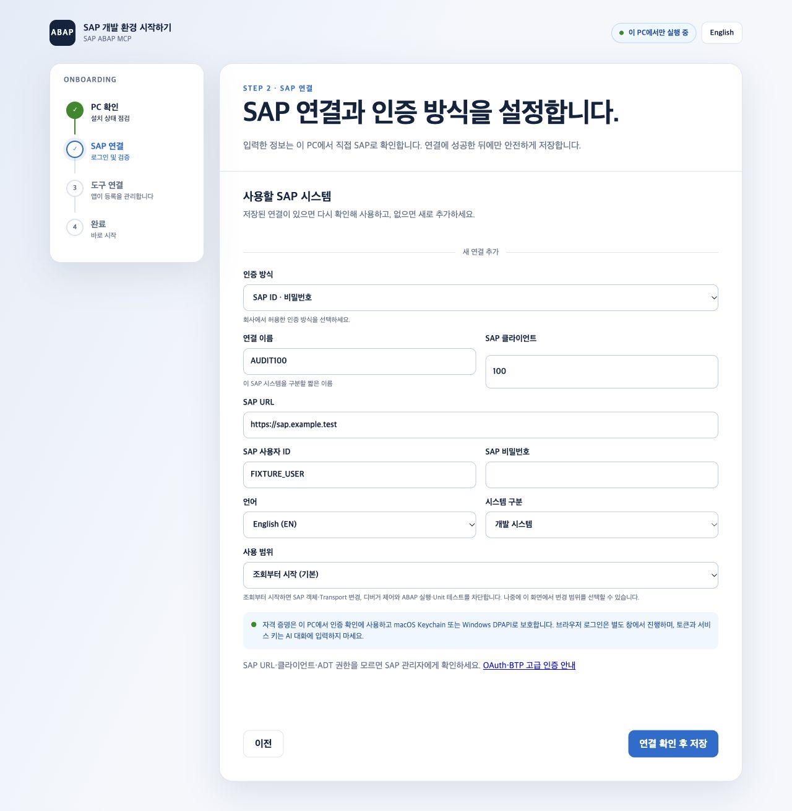
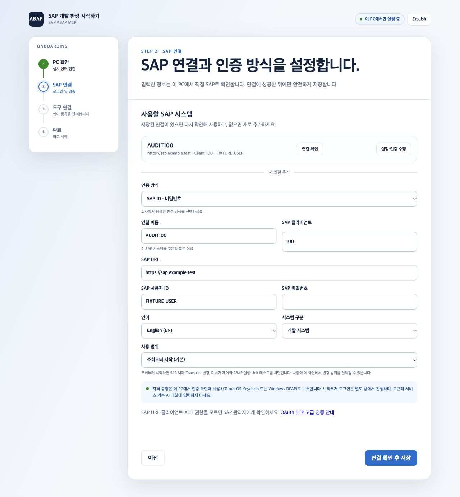

# SAP ABAP MCP 경쟁 비교와 개선 — 2026-10-01

현재 결론: 기존 제품의 강점은 독립 실행, 여러 SAP 시스템 관리, 변경 정책,
검증 근거다. 세계 최고를 목표로 할 때 남은 큰 격차는 **기업 인증의 실환경
완성도, 초보자 설정 범위, 실제 작업 성공률의 비교 근거**다. 도구 개수나
단위 테스트 개수로 순위를 정하지 않는다.

이번에는 경쟁 제품의 개발자 문서·공식 SAP 문서를 현재 소스와 비교했다.
경쟁 MCP를 같은 SAP에 연결한 성능 실험은 하지 않았다. 경쟁사의 기능·테스트
설명은 공개 주장이고, 우리의 독립 재현 결과가 아니다.

## 기준과 출처

로컬 기준은 `@coaspe/sap-abap-mcp` 1.7.1, 기준 커밋
`b411037456a9f70a16e43f58bcfdf82644cf8ed5`다. 조사 때 npm latest도 1.7.1이며
gitHead가 일치했다. 이번 변경은 그 위의 미배포 변경이다. 저장소별 조회
커밋·날짜와 npm integrity는
[조회 기록](competitive-ux-2026-10-01/source-snapshot.json)에 있다.
웹으로 읽은 기본 브랜치 문서는 이후 바뀔 수 있다. 조회 커밋이 경쟁 패키지의
최신 배포 버전이라는 뜻은 아니다.

| 비교 대상 | 현재 공개된 강점 | 우리 코드와 비교한 판단 |
|---|---|---|
| [SAP 공식 ADT MCP](https://developers.sap.com/tutorials/abap-dev-adt-mcp-server-tools/) | 기존 ADT destination이 있으면 설정에서 MCP를 활성화한다. 외부 호스트에는 로컬 HTTP와 bearer token을 제공한다. | 이미 ADT를 쓰는 사람에게 연결 재입력이 적다. 우리 독립 Node 실행은 장점이지만 SAP URL·계정·클라이언트를 다시 알아야 한다. 공식 제품 통합·지원은 자체 도구 수로 대체되지 않는다. |
| [ARC-1](https://github.com/arc-mcp/arc-1) | BTP Destination·Cloud Connector·사용자 신원 교환·Audit Log, 의도 기반 도구, KTD와 의존 계약 문맥, Claude Desktop MCPB 설치를 설명한다. | 가장 중요한 기업용 직접 경쟁자다. 우리는 Destination·OIDC·사용자별 전송 코드를 갖췄지만 실제 BTP 신원·권한 연동을 완료했다고 검증하지 못했다. 캐시·KTD·공개 계약 기능은 이미 있으므로 다시 미구현이라고 평가하지 않는다. |
| [williansaez/abap-adt-mcp](https://github.com/williansaez/abap-adt-mcp) | 브라우저 SSO, SSO2, 오류의 hint·nextTools, 긴 호출 진행 알림, 설정 후 첫 읽기 예시를 제공한다. | 우리 OAuth Authorization Code + PKCE는 이미 있다. 다만 일반 기업 SAML/Kerberos 브라우저 SSO와 동일하지 않다. 후속 로컬 변경에서 웹 설정에도 OAuth·BTP 서비스 키 인증을 연결했다. 복구 안내·진행 알림·첫 조회 문구의 부족은 이번에 개선했다. |
| [fr0ster/mcp-abap-adt](https://github.com/fr0ster/mcp-abap-adt) | ABAP Cloud·온프레미스 인증과 별도 configurator로 여러 클라이언트 등록을 설명한다. | 우리 마법사는 기존 설정 진단·안전한 자격 증명 저장이 강점이나 자동 등록이 Claude Code·Codex에 한정된다. 다른 호스트 설정과 인증을 같은 흐름에서 끝내는 범위는 작다. |
| [OpenADT](https://github.com/abapify/openadt/blob/main/docs/openadt-mcp.md) | 독립 실행파일에서 SAP 공식 도구와 LSP 도구를 합치고 설정 출력·연결 검사·공유 backend를 제공한다. | 화면 없는 경쟁 제품도 있다. 우리는 ADT backend 없이 동작하는 점을 차별화해야 한다. 단일 설치파일과 공유 backend 운용 경험은 별도 비교 대상이다. |
| [VSP](https://github.com/oisee/vibing-steampunk) | Go 단일 실행파일, RFC/HTTPS 디버거, SAT 분석·MIME·클러스터 읽기 등 깊은 분석을 설명한다. | 우리는 ABAP 디버거·dump·trace가 있어 ‘디버거 부재’는 틀린 평가다. RFC·클러스터·AMDP 등 동일한 깊이는 입증하지 못했다. 경쟁 문서의 미완성·계획 항목을 완료 기능으로 계산하지 않는다. |
| [ABAP FS](https://github.com/marcellourbani/vscode_abap_remote_fs) | VS Code의 ABAP workspace와 IDE/에이전트 경험을 결합한다. | 우리의 2.6.5 고정 버전 호환 검증은 현재 최신 ABAP FS 전체와의 동등성을 뜻하지 않는다. IDE 없는 운영은 우리 강점이며, 저장소 탐색·편집 경험은 실제 작업으로 비교해야 한다. |

진행 알림은 [MCP 공식 규격](https://modelcontextprotocol.io/specification/2025-11-25/basic/utilities/progress)
및 설치된 SDK 1.30.0의 request callback 정의를 확인했다. Context7과 sequential
thinking MCP는 최초 조사 때 도구 목록에 없었다. 후속 인증·토큰 개선에서는
두 MCP가 제공되어 사용했으며 공식 MCP 규격도 재확인했다.

## 첫 설정은 지금도 편한가

**Windows/macOS + Basic Auth + Claude Code/Codex 사용자에게는 기반이 좋다.**
한 명령으로 브라우저를 열고, 이미 설치된 도구·프로필을 진단하고, SAP 로그인
검증 후 저장하고, 공식 클라이언트 CLI로 등록한다. Keychain/DPAPI 사용과 실패
시 기존 설정 보존도 구현되어 있다. 새로운 설정 시스템을 만들 필요는 없다.

다만 모든 사용자에게 충분히 쉽다고 판정할 근거는 없다. 다음 제한이 남는다.

1. Node/npm이 없는 사람은 `npx ... onboard`를 시작할 수 없다. 마법사 안의 설치
   진단이 이 진입 문제까지 해결하지는 않는다. 서명된 설치파일이나 명확한
   운영체제별 사전 준비 화면을 실제 첫 사용자에게 시험해야 한다.
2. 후속 로컬 변경에서 웹 UI는 영어·한국어와 Basic·OAuth 클라이언트·브라우저
   PKCE·BTP ABAP 서비스 키를 지원한다. 실제 기업 SSO 호환성과
   요청별 BTP Destination 설정은 추가 검증·개선이 필요하다.
3. 자동 등록은 Claude Code와 Codex 두 CLI다. Claude Desktop·VS Code·Cursor 등은
   기존 수동/플러그인/MCPB 경로를 사용해야 한다. Linux는 웹 비밀번호 저장을
   제공하지 않아 환경변수 방식으로 설정한다.
4. 후속 로컬 변경은 `sap-abap` 기존 등록의 실행 경로·프로필·저장 위치를 선택한
   연결과 비교한다. 다른 값이나 비교할 수 없는 설정은 안내하며 자동 변경하지
   않는다. 커스텀 wrapper·수동 설정과 실제 SAP 첫 조회는 별도 확인이 필요하다.
5. SAP URL·클라이언트·ADT 권한·사내 인증서를 스스로 알 수 없는 사람이 있다.
   개발·품질 프로필의 빈 패키지 목록은 제한 없음이므로 설정 설명도 명확해야 한다.

이 평가는 소스·자동 테스트·아래 브라우저 데모에서 얻은 것이다. 초보 사용자
인터뷰나 실제 회사 노트북에서의 설치 성공률 측정은 하지 않았다.

## 이번에 구현한 개선

| 개선 | 이제 가능한 행동 | 검증 범위 |
|---|---|---|
| v1 오류에 선택형 `recovery` 추가 | 인증, SAP 권한, 소스 충돌, 오래된 schemaHash, 미지원 기능, 정책 거부, 중단된 SAP 호출에서 다음 행동을 받는다. | 실제 MCP 오류 envelope와 비밀값 제거 테스트. 기존 code/category/retryable을 유지한다. |
| MCP 진행 알림 | 요청에 progressToken이 있으면 시작·5초 간격 경과·종료 알림을 받는다. | 실제 MCP Client로 직접·minimal·single 경로 확인. 취소 후 멈춤과 알림 전송 실패를 확인한다. |
| 웹 설정 오류 진단 | SAP 401/403을 인증/권한 오류로 구분하고, VPN·URL·인증서·클라이언트 등록 복구 안내를 보여준다. | SAP 라이브러리 예외를 사용하는 HTTP 테스트. 오류 메시지를 정제하고 원시 details는 반환하지 않는다. |
| 설정 후 첫 조회 | 선택한 프로필을 포함한 읽기 전용 첫 조회 문구를 복사한다. 등록 상태만으로 SAP 성공을 주장하지 않는다. | 브라우저 데모에서 실패 후 재입력·다음 단계·완료·복사 확인. |
| 화면과 설명 | 좁은 화면의 단계선이 글자를 가리지 않으며, Keychain/DPAPI·SSO 안내와 빈 패키지 제한의 의미가 표시된다. | 브라우저 화면 확인. 실제 모바일·Windows·스크린리더 검증은 별도다. |

`recovery.nextTools`는 논리적인 capability 이름이다. 현재 광고된 도구를 먼저
확인하고, gateway 모드라면 describe 후 해당 risk의 invoke를 사용한다. 선택된
toolset 또는 role에 없는 도구를 이 필드가 새로 허용하지 않는다. 정책 거부에서
우회나 권한 완화를 권하지 않으며, 서버가 호출을 자동 재시도하지 않는다.
`retryable`은 일시적 오류의 기존 분류다. **쓰기 재시도 허가가 아니다.**
SAP 응답이 끊겼다면 대상의 실제 상태부터 확인한다.

진행 숫자는 알림 순서이며 SAP 작업 완료율이 아니다. total을 추측하지 않는다.
취소는 알림을 멈추지만 이미 진행 중인 SAP 쓰기를 취소하거나 되돌린다는 보장은
없다. MCP 호스트가 progressToken을 보내고 알림을 표시해야 화면에 보인다.
알림에는 요청 인자·SAP 소스·비밀번호가 포함되지 않는다.

## 다음 우선순위와 완료 기준

| 우선순위 | 작업 | 완료 판단 |
|---|---|---|
| P1 | BTP 기업 환경 검증과 미완성 인증 경로 | 개발 BTP에서 사용자 A/B 권한 분리, Destination/Cloud Connector 또는 token exchange, 갱신·거부·로그아웃·감사 근거를 확인한다. 기존 전송 테스트 통과를 실환경 성공으로 바꾸어 쓰지 않는다. |
| P1 | 설정에서 OAuth/service-key 흐름 통합 및 기업 SSO 경로 | 이미 있는 인증·저장 코드를 재사용한다. 계정 입력·로그인 취소·만료·재개를 실제 지원 IdP에서 확인한다. 비밀번호 수집으로 SSO를 대체하지 않는다. |
| P1 | 안전 기본값과 첫 사용자 설정 확대 | 읽기 전용 웹 첫 시작과 명시적 패키지 선택, 영어 UI를 로컬 구현했다. 신규 설치·중단 복구·실사용자 시험은 별도 검증한다. 기존 사용자의 정책을 자동 변경하지 않는다. |
| P1 | 동일 과제 비교시험 | 같은 SAP·계정·객체·호스트·모델로 아래 5개 과제를 실행한다. 실패/미지원/건너뜀을 분모에서 숨기지 않는다. |
| P2 | 런타임·운영 분석 깊이와 설치파일 | VSP와 비교할 실제 장애 과제를 먼저 정한다. backend·권한 근거 없이 RFC/AMDP API를 추측해 구현하지 않는다. 배포파일은 서명·무결성·업데이트·삭제 후 재설정까지 시험한다. |

후속 작업별 소요시간은 BTP/IdP 접근과 대상 OS를 확정한 뒤 추정한다. 인증 환경이
없는 상태에서 며칠이면 완성된다고 약속하지 않는다.

## 세계 최고를 판단할 비교시험

처음에는 제품 수가 아닌 과제를 고정한다. 각 제품에서 같은 허용 범위로 다음을
실행하고, 실행 버전과 환경을 기록한다.

1. 처음 설정부터 첫 시스템 조회: 설치·입력·권한 오류·중단 후 재개까지 기록.
2. 클래스/메서드 설명: 소스 근거, KTD 일치 여부, 사용처와 의존 계약의 누락 평가.
3. 승인된 개발 객체 수정: stale source 충돌을 주입하고 진단·활성화·Unit·ATC 확인.
4. transport 검토: 변경 범위·검사 누락·증거를 평가하며 release는 수행하지 않음.
5. 장애 원인 분석: 같은 dump/trace에서 근거 있는 원인과 검증 가능한 수정 제안 평가.

과제별 성공/부분/실패/미지원, 잘못된 변경, 복구 성공 여부, 실제 SAP 왕복 수,
경과 시간, 호스트의 모델 사용량, 사람의 개입 횟수를 기록한다. 과금 토큰과
스키마 토큰 추정을 구별한다. SAP 작업은 승인된 개발 범위에서만 수행하고,
대외 공개에는 익명화된 결과만 사용한다. 테스트가 제공된 것과 실제 통과한
것도 별도로 기록한다. 아직 이 비교시험을 실행하지 않아 세계 1위라고 말할 수 없다.

## 이번 검증과 재현

기존 소스 566/566, 개선 후 전체 572/572 테스트 통과. 회귀 테스트에는 실제
MCP Client와 in-memory transport, 임시 프로필, SAP test double을 사용했다.
실제 SAP나 회사 자격 증명, 사용자의 클라이언트 설정은 사용하지 않았다.

원본 폴더의 일부 Git/의존성 파일이 macOS `dataless` 상태여서 읽기가 대기했다.
현재 소스를 임시 로컬 폴더로 복사하고 같은 lockfile로 `npm ci --ignore-scripts`를
실행해 검증했다. 이는 원본 의존성의 재설치나 사용자 설정 초기화가 아니다.
검증한 동일 소스의 빌드 결과를 원본 `dist`에도 반영하고 주요 실행파일의 바이트
일치를 확인했다. 원본 폴더에서 직접 빌드·전체 테스트가 통과한 것으로 기록하지 않는다.

```bash
npm test
npm run smoke:v1
npm run conformance:v1
```

기본/minimal 5개, adaptive 17개, full 120개, single 1개 도구의 stdio smoke가
통과했고 각 모드에서 7개 Resource·4개 프롬프트를 확인했다. v1 호환 프로파일도
통과했으며 npm pack dry-run에 진행 알림 실행파일과 조사 문서가 포함됐다.
[검증 기록과 소스 해시](competitive-ux-2026-10-01/verification.json)를 참고한다.

UI 데모 캡처: [PC 진단](competitive-ux-2026-10-01/01-pc-check.jpg),
[인증 오류](competitive-ux-2026-10-01/02-auth-recovery.jpg),
[등록 상태](competitive-ux-2026-10-01/03-client-registration.jpg),
[첫 조회 문구](competitive-ux-2026-10-01/04-first-query.jpg).
합성 SAP URL과 계정을 사용한 데모다. 연결됨 배지는 가짜 CLI 응답이며 실제
SAP·Claude·Codex 연결의 증거가 아니다. 제품 성능·접근성 인증도 아니다.

패키지 버전은 올리지 않았고 npm 게시·GitHub push·SAP 변경은 수행하지 않았다.

## 후속 구현 — 고급 인증과 탐색 호출 절감

브라우저 설정에서 인증 방식을 선택하고 동일한 보호 저장소를 사용한다.
BTP 서비스 키는 SAP URL·클라이언트·OAuth 설정을 자동으로 채운다.
OAuth 로그인 취소·타임아웃·토큰 교환 취소 시 루프백 서버를 종료하고,
인증 실패나 저장 전 취소 시 기존 프로필·자격 증명을 보존한다.

기능 스키마 조회는 기존 `sap.capability.describe`에 `names` 배열을 추가해
한 호출로 최대 10개를 받는다. 도구 수는 5개로 유지한다. 단일 `name` 응답과
스키마 해시·역할 격리·읽기/쓰기 위험 검사는 유지한다. MCP 호환성을 위해
JSON 텍스트와 구조화 결과를 모두 제공한다.

합성 200줄 읽기·변경 재확인·진단 작업에서 `minimal` 모드의 전체 호출은
8회에서 6회, 도구 정의·초기 안내·요청·응답 합계는 16,863에서 16,650
`o200k_base` 토큰으로 줄었다. 입력 필드 추가와 도구 설명 축약을 함께 적용해 고정 도구 정의도
883에서 880 토큰으로 줄였다. 실제 과금·모델 성공률·네트워크 지연의 측정은 아니다.

후속 전체 테스트 590/590, stdio 모드 5개와 v1 conformance 검증이 통과했다.
[후속 검증 기록](competitive-auth-tokens-2026-10-01/verification.json),
[토큰 비교](competitive-auth-tokens-2026-10-01/token-summary.json),
[BTP 화면](competitive-auth-tokens-2026-10-01/01-btp-service-key.jpg),
[브라우저 OAuth](competitive-auth-tokens-2026-10-01/02-browser-oauth.jpg),
[390px OAuth](competitive-auth-tokens-2026-10-01/03-narrow-oauth.jpg)를 참고한다.
브라우저 흐름은 합성 인증 제공자로 확인했으며 실제 SAP·회사 IdP 로그인은
아직 검증하지 않았다. BTP 사용자별 권한 격리와 동일 작업 경쟁 비교는 남는다.


## 후속 검증: 동시 사용자 격리와 영어 초기 설정

실제 OIDC 서명을 검증하는 MCP HTTP 세션 두 개에서 같은 Destination 프로필과
같은 소스 URI를 동시에 조회했다. SAP 응답은 모의 값이며, 세션·연결 소유권·
SourceCache·minimal 게이트웨이·감사 기록은 운영 코드를 사용했다. 같은 ETag라도
사용자별 소스가 분리됐고, 권한 거부 뒤 캐시 반환 없이 해당 캐시가 제거됐다.
다른 사용자의 세션 재사용은 HTTP 403으로 거부됐다. 한 사용자 로그아웃 뒤에도
다른 사용자는 조회를 계속했다. 감사 기록에는 호출자 신원이 남고 JWT·소스 본문은
남지 않았다. 별도 실제 SAP SDK의 로컬 프록시 시험에서도 동시에 끝나는 교환
결과의 사용자 토큰·쿠키가 분리되고, 실패한 교환 뒤 SAP 요청이 전송되지 않았다.

웹 설정은 브라우저 선호 언어에 따른 영어·한국어 화면과 전환 링크를 제공한다.
인증 안내·복구 문구·첫 조회 문구 135개를 번역했고 SAP 조회 언어와 구분했다.
전환은 페이지를 다시 열므로 입력 전에 선택한다. 390px에서 가로 넘침 없이
OAuth 입력 화면을 확인했다. 실제 휴대전화 접근성 검증은 수행하지 않았다.

전체 테스트 609개, 5개 stdio 모드, 프로필 탐색 conformance가 통과했다.
동일한 16개 모의 워크플로의 고정 스키마·총 토큰·호출 수는 이전 배치 조회
결과와 같았다. minimal은 도구 5개·스키마 880토큰을 유지하며, 짧은 조건부
known-capability 시험은 6회 호출·총 16,650토큰이다. 이는 o200k 추정값이며
모델 과금이나 경쟁 제품의 실제 성공률을 뜻하지 않는다.

[검증 기록](competitive-isolation-onboarding-2026-10-01/verification.json),
[영어 설정 화면](competitive-isolation-onboarding-2026-10-01/02-english-oauth.jpg).
현재 CLI 설정의 프로필은 0개로 확인됐다. 실 BTP/SAP 권한 시험과 동일 과제
경쟁 비교는 여전히 필요하며, 이 변경은 게시하지 않았다.

## 후속 구현: 조회부터 시작하는 접근 범위

새 웹 프로필은 읽기 전용으로 시작하며 첫 조회에 개발 패키지를 요구하지 않는다.
변경을 허용하려면 선택한 패키지 목록을 입력하거나 모든 패키지를 명시적으로
선택한다. 운영 환경에서는 변경 선택을 비활성화한다. 기존 프로필의 정책은
자격 증명 갱신 때 보존하며 터미널 편집에서도 유지된다. 수동 CLI 신규 프로필은
기존 기본값을 유지하고 `--read-only` / `--allow-writes`로 명시한다.

읽기 전용 거부는 SAP 객체·Transport 변경, 디버거 제어, ABAP 실행·Unit에
적용된다. 소스·구조 조회와 정적 검사/ATC는 SAP 권한 아래 제공된다. 직접 SQL은
별도 opt-in 정책을 유지한다. 저장된 범위 변경은 다음 연결 획득부터 캐시된
클라이언트에도 반영되며 추가 SAP 로그인을 하지 않는다. 이미 허용된 작업의
중단·롤백이나 패키지로 ABAP 실행 전체를 격리하는 기능은 아니다.

이전 로컬 빌드가 형식 1의 새 `readOnly` 값을 버리는 경우를 재현했다. 명시적
정책은 형식 2에 저장하여 이전 런타임이 파일을 거부하도록 했다. 비교 대상은
수정 전 로컬 실행파일의 사본이며 게시된 npm 패키지 실행 시험은 아니다.
새 등록은 설정 마법사를 실행한 Node·서버 경로를 사용하지만 기존 등록은
자동 변경하지 않는다. 새 정책을 사용하기 전 해당 등록의 실행파일을 확인한다.

전체 616개 테스트와 5개 stdio 모드, 탐색 conformance가 통과했다. 이전 단계의
동일한 16개 모의 워크플로에서 도구 수·호출 수·SAP service double 호출 수는
같았다. 기본 minimal은 5개 도구·스키마 880토큰·짧은 조건부 작업 6회 호출과
총 16,650토큰을 유지한다. single도 같고 full/adaptive는 선택적 정책 출력 필드로
스키마·총 합계가 각각 8토큰 늘었다. o200k 추정치이며 실제 모델 과금이 아니다.

[검증 기록](competitive-readonly-2026-10-01/verification.json),
[조회 시작 화면](competitive-readonly-2026-10-01/01-readonly-start.jpg),
[패키지 선택](competitive-readonly-2026-10-01/02-explicit-packages.jpg),
[390px 운영 환경](competitive-readonly-2026-10-01/03-production-narrow.jpg).
화면은 실제 로컬 설정 서버·합성 도구 탐지로 확인했으며 SAP 인증은 비활성화했다.
소스와 검증 미러의 일치를 확인한 빌드를 원본 dist에 반영했다. 실제 SAP·IdP·
신규 사용자 설치 완료율·경쟁 제품 성공률 검증과 게시 절차는 남는다.

### 추가 설치 검증: 실제 Codex CLI

미배포 로컬 tarball을 공백이 포함된 새 임시 폴더에 설치하고, 설정 HTTP API와
실제 Codex CLI 0.153.4를 사용해 별도 Codex 설정 폴더에 등록했다. 기존 합성
서버 항목이 보존됐고 반복 등록은 파일을 다시 쓰지 않았다. Codex가 저장한
실행 경로로 실제 MCP SDK Client를 연결해 도구 5개와 형식 2 프로필의 읽기 전용
표시를 확인했다. Node 24.11.1/macOS에서 설치 2,408ms·MCP 초기화 392ms였으며
한 번의 실행 측정이다. 모델 요청은 하지 않았고 SDK가 Codex 등록 명령을
실행했으므로 Codex 모델의 도구 선택 성공률이나 첫 SAP 조회 성공률은 아니다.

SAP 인증은 합성 검증기와 메모리 자격 증명 저장소를 사용했다. 설치된 서버의
조회 결과는 `credentialAvailable: false`였으며, 실제 Keychain·DPAPI 저장과 SAP
접속 성공을 주장하지 않는다. 사용자 설정은 변경하지 않았고 임시 폴더는
시험 뒤 정리했다. Windows/Linux·Claude 실제 CLI·Node 없는 신규 PC 시험은 남는다.
[설치 검증 기록](competitive-readonly-2026-10-01/first-install-codex.json).
등록 방식과 설정 위치는 [공식 MCP 안내](https://learn.chatgpt.com/docs/extend/mcp?surface=cli)와
[설정 위치 문서](https://learn.chatgpt.com/docs/config-file/config-advanced)를 확인했다.

## 후속 구현: 기존 등록 비교와 실제 Claude 등록 실패 수정

공식 문서를 확인한 뒤 실제 Claude Code 2.1.286으로 현재 명령을 실행했다.
서버 이름이 가변 길이 `--env` 뒤에 있어 환경변수로 해석됐고 등록이 실패했다.
서버 이름을 먼저 배치해 해결했다. 새 체크 표시 `✔`가 연결 상태 파서에서
누락된 경우도 확인해, 현재 기호와 실패 뒤 상세 메시지를 처리하도록 했다.

선택한 프로필의 Step 3에서는 Codex JSON·Claude 상세 출력으로 실행 경로,
stdio/v1, 프로필, 저장 위치와 활성 상태를 비교한다. `--profile=...` 및 API 버전
등호 형식도 다루며 HTTP 시작 옵션과 마지막 API 버전 값도 확인한다. 전체
프로필을 노출하는 현재 실행파일은 선택한 프로필을 조회할 수 있는 설정으로
인식한다. 기존 preset·다른 옵션·등록은 보존한다. 다른 값 또는 비교 불가 상태는
수정할 값과 공식 안내를 제공하며, 쓸 수 있는 일치 등록이 확인돼야 완료할 수 있다.
환경변수 참조는 해석됐다고 가정하지 않는다. 이 비교는 파일 경로·표시된 설정
근거이며 외부 패키지 내용·실행 중 worker 버전·SAP 인증을 검증하는 것은 아니다.

실제 Claude CLI로 수정 뒤 등록·MCP 연결·상세 설정 일치를 확인했다. 별도 설치한
로컬 tarball과 실제 Codex CLI 0.153.4에서는 원래 항목 보존·재등록 무변경·다른
프로필 감지와 무변경을 확인했다. 기록된 실행 경로에서 MCP SDK가 도구 5개와
읽기 전용 프로필을 확인했다. 모든 설정은 임시 폴더로 격리했고 SAP 로그인·
모델 호출·사용자 설정 변경은 하지 않았다. CLI 설치와 경로 비교는 macOS만
시험했으며 Windows/Linux 및 실 SAP 첫 조회는 남는다.

전체 617개 테스트, 5개 stdio 모드와 탐색 conformance가 통과했다. 이전 단계의
16개 모의 워크플로에서 도구 수·스키마/총 토큰·호출 수가 모두 같았다. 기본
minimal 5개·스키마 880토큰을 유지하며, 이 설정 검사는 일반 MCP 세션의 새
도구나 모델 호출을 추가하지 않는다. 설정 중에는 클라이언트 상세 조회가 추가된다.
[검증 기록](competitive-registration-2026-10-01/verification.json),
[등록 불일치 화면](competitive-registration-2026-10-01/01-registration-mismatch.jpg).
화면은 실제 로컬 설정 서버와 합성 CLI/SAP 응답이며 실제 회사 시스템 연결
증거가 아니다. 실제 CLI 시험 기록은 화면 데모와 별도로 보관했다.


## 후속 구현: 실제 작업 문구 탐색과 비교 기준

기존 5개 과제를 [동일 과제 합격 기준](abap-task-comparison.md)으로 구체화했다.
설정·객체 설명·수정 검증·transport 검토·장애 분석마다 같은 입력과 외부 검증
근거를 요구한다. 실패·미지원·미실행을 분모에서 숨기지 않고 과금 토큰과 고정
스키마 추정을 분리한다. SAP/모델 실행 결과를 아직 채우지 않았으므로 비교
성공률이나 세계 최고·표준 지위를 주장하지 않는다.

탐색 예비시험에서 `find callers of a method`는 5위, 클래스 의존성과
`review transport changes`는 상위 5개 밖이었다. `review`가 `preview` 내부에서
일치하는 등 부분 문자열이 순위를 왜곡했다. 단어·구문 경계를 적용하고 실제
기능 설명을 축약해 해결했다. 추가 6개 문구를 포함한 162개 모드/역할 검사가
통과했고, 기존 exact name·schemaHash·역할·risk 격리를 유지한다. 임의의 단어
조각과 구두점만 있는 검색은 결과 없음이다. 한국어 의도·동의어·부정문 해석과
모델 선택 성공률을 검증한 것은 아니다.

현재 npm 배포 ARC-1 1.4.0의 schema factory를 호출해 같은 o200k 토크나이저로
측정했다. standard 기본은 도구 9개·11,285토큰, hyperfocused는 1개·209토큰이다.
우리 기본 minimal은 5개·880토큰, single은 1개·215토큰이다. 우리 single이 경쟁자보다
항상 작다는 주장은 틀리다. 권한·기능·서버 안내·탐색 비용이 다른 cold-schema
비교이며 실제 과금·작업 완료 비용이 아니다. npm 무결성과 모듈 해시를 기록했고
경쟁 서버의 SAP 로그인이나 사용자 설정 변경은 하지 않았다.

전체 618개 테스트·5개 stdio 모드·탐색 conformance가 통과했다. 기존 16개 조건부
워크플로에서 minimal/single 토큰과 호출 수는 같고 full/adaptive는 설명 축약으로
각각 7/3토큰 줄었다. LobeHub의 기존 describe 스키마 목록도 현재 5개 도구와
동기화했다. [검증 기록](competitive-task-discovery-2026-10-01/verification.json).
미배포 변경이며 실 SAP·동일 모델 과제 수행과 독립 채택 검증은 남는다.


## 후속 구현: Node 설치 없이 시작하는 Desktop 번들

Claude Desktop은 Node를 내장한다는 [공식 안내](https://support.claude.com/en/articles/10949351-getting-started-with-local-mcp-servers-on-claude-desktop)를 확인했다.
기존 MCPB를 빈 폴더에서 실행하니 package.json 상대 경로가 맞지 않아 MCP 초기화
전에 종료됐다. dist/src 구조와 루트 메타데이터를 번들에 포함해 고쳤으며,
포장 전에 독립 실행을 검사하도록 했다. esbuild와 MCPB 도구도 버전을 고정했다.

미배포 번들은 프로필이 없을 때 기존 Basic/OAuth/BTP 브라우저 마법사를 연다.
설치한 앱이 등록을 관리하므로 추가 CLI 설치·npm 조회·중복 MCP 등록을 요구하지
않는다. SAP 검증을 통과한 선택 프로필만 완료할 수 있고, 기존 프로필이 있으면
자동 설정을 열지 않는다. 새 프로필의 읽기 전용 기본값·보호 저장소·루프백 토큰과
출처 검사를 유지한다. 설정 창 종료와 MCP 프로세스 종료를 구분한다.

독립 번들을 절대 경로 Node와 빈 PATH로 실행해 초기화·5개 도구·첫 설정 URL·
기존 읽기 전용 프로필·미검증 완료 차단·설정 서버 종료를 확인했다. 이는 호스트
Node 실행을 재현한 macOS 로컬 시험이며 실제 Claude Desktop 앱의 설치·첫 사용자
완료율, Windows DPAPI, 실 SAP/IdP 접속 성공을 증명하지 않는다.
[설정 안내](desktop-bundle-setup.md), [검증 기록](competitive-mcpb-2026-10-01/verification.json).
기존 프로필 사용자의 Node 없는 자격 증명 갱신 UI와 공개 서명·배포도 별도다.

## 후속 구현: 여러 소스의 조건부 재조회

개별 조회만 지원하던 변경 없음 응답을 `sap.source.read_batch`에도 적용했다.
각 항목의 `ifNoneMatch`는 이전 배치 결과의 해시이며, 실제 읽기 경로를 거친 뒤
일치하는 코드만 생략한다. 시스템·객체·요청 범위·출처·반환 페이지를 검증하고,
변경·실패·잘림·이어 읽기는 유지한다. 생략된 코드는 64 KiB 출력 한도를 쓰지
않아 뒤의 객체를 읽을 수 있다. 성공 응답은 입력 해시를 중복해서 반환하지 않는다.

동일한 합성 5개 객체·100행·20회 재확인·외부 수정 과제에서 기본 minimal의
기존 전체 배치는 512,408 추정 토큰·23회 MCP 호출, 기존 개별 조건부 조회는
77,682토큰·111회, 새 조건부 배치는 69,266토큰·23회였다. 읽기 경로는 모두
110회이며 코드 복원과 외부 수정 반영을 검증했다. 기본 5개 도구·880 스키마
토큰과 single의 1개·215토큰은 같다. full 스키마는 43토큰 증가한다.

처음 읽기는 해시·플래그 비용이 추가된다. 초기 안내·스키마·describe·요청·두
응답 표현을 포함한 o200k 추정치이며 실제 과금·SAP HTTP 요청·모델 작업 성공률
또는 경쟁자 우위를 입증하지 않는다. 새 회귀 검사 8개는 기존 런타임에서 실패하고
변경 후 전체 628개 테스트가 통과했다. SAP/IdP와 동일 모델 경쟁 과제 검증은 남는다.
[사용법](batch-source-reads.md#conditional-batch-rechecks-unreleased),
[검증 기록](competitive-conditional-batch-2026-10-01/verification.json).

## 후속 구현: Desktop 기존 연결의 재인증 복구

기존 프로필이 있으면 설정 창이 열리지 않아 Node를 설치하지 않은 사용자는
자격 증명 만료/분실을 추가 CLI로 해결해야 했다. MCPB에 기본 꺼짐인
`Open SAP setup on startup` 설정을 추가했다. 켜고 확장을 재시작하면 기존
Basic/OAuth/BTP 설정 화면을 다시 열며, 인증 후 설정을 꺼 반복 실행을 방지한다.
공식 MCPB 2.1.2 변환기로 boolean 값의 환경 변수 치환을 확인했다. 기존 번들은
명시적 재열기 검사에서 실패했고 새 번들은 첫 실행·기존 연결 기본 실행·명시적
재열기 세 경우를 통과했다. 실제 Desktop 설정 UI를 시험한 것은 아니다.

인증 오류에 이 복구 경로를 표시하고, 저장 성공 후 해당 프로필의 SAP 연결
캐시만 해제한다. 비밀값 저장만으로는 이전 클라이언트가 재사용되는 것을 확인했고,
다음 연결이 새 자격 증명을 사용하도록 했다. 실패한 인증은 기존 프로필·비밀값·
연결을 유지한다. 다른 프로필은 유지하고 진행 중인 SAP 작업을 취소하지 않는다.
Basic·OAuth client credentials·브라우저 OAuth의 검증/보존/완료 검사를 추가했다.

전체 632개 로컬 테스트가 통과했다. MemorySecretStore와 합성 인증기를 이용한
브라우저에서 만료 감지·폼 채우기·읽기 범위 유지·재인증·첫 조회 안내를 확인했다.
새 MCP 도구는 없으며 정상 워크플로의 스키마·호출·토큰 비용을 별도로 비교한다.
실제 SAP/IdP·Desktop 설치·Windows DPAPI·모델 과금과 표준 채택 검증은 남는다.
[복구 사용법](desktop-bundle-setup.md#sign-in-again-or-add-another-connection),
[검증 기록](competitive-desktop-recovery-2026-10-01/verification.json).

## 후속 구현: 재인증과 OAuth 갱신의 동시 실행

이전 OAuth 응답이 무효화 후 도착하거나 보호 저장소의 쓰기가 지연되면 새 로그인
정보를 덮어쓸 수 있었다. 네 가지 회귀 테스트가 변경 전 런타임에서 실패했고,
저장을 지연한 경우 실제로 합성 새 로그인 값이 이전 갱신 값으로 바뀌었다.
두 OAuth 공급자는 무효화된 요청의 늦은 응답을 반환하거나 캐시하지 않도록 했다.
브라우저 OAuth는 저장 성공 후 토큰을 캐시한다.

같은 서버에서 공유하는 SecretStore의 프로필별 갱신·설정 저장을 순서대로
처리한다. 이미 교체된 자격 증명에 대한 갱신은 거부한다. 진행 중인 저장은 먼저
완료하고 새 로그인은 뒤에 저장하며, 실패 시 복구도 다음 저장 전에 마친다.
다른 프로필은 동시에 처리한다. 별도 CLI/서버 프로세스의 저장을 잠그거나
운영체제의 진행 중인 저장을 취소하는 기능은 아니다.

추가 검사 8개를 포함해 전체 640개 테스트가 검증 복사본에서 통과했다.
실제 MCP 클라이언트와 o200k tokenizer를 이용한 정상 작업 16개 시나리오는
변경 전후 JSON 결과가 동일했다. 기본 도구 5개·스키마 880토큰, single 도구
1개·215토큰을 유지한다. 모델 과금이나 경쟁 제품 작업 성능 측정은 아니다.
실제 SAP/IdP·네이티브 보호 저장소의 지연·Desktop 설치·표준 채택은 미검증이다.
[검증 기록](competitive-oauth-renewal-2026-10-01/verification.json).

## 후속 구현: HTTP MCP의 OAuth 로그인 서버 발견

현재 프로세스의 기본 설정 파일과 SAP 연결 환경변수를 확인했으나 구성된 SAP
대상이 없어 동일 SAP·모델 과제는 실행하지 못했다. 다른 설정 디렉터리나
사용자 호스트의 연결까지 없다고 판정한 것은 아니다. 실제 비교는 미실행 상태다.

ARC-1의 [고정 커밋 인증 문서](https://github.com/arc-mcp/arc-1/blob/a1875eaa34ccee97e3d0085ed4bdb0df1e6bb88f/docs_page/xsuaa-setup.md)는
OAuth 발견·XSUAA 로그인 프록시·S256과 클라이언트 설정을 설명한다. 실제 해당
경쟁 서버의 로그인은 시험하지 않았다. 우리 HTTP 서버는 JWT 검증은 있었지만
클라이언트가 발급자를 발견할 보호 리소스 메타데이터가 없었다.
[MCP 인증 규격](https://modelcontextprotocol.io/specification/2025-11-25/basic/authorization)과
[RFC 9728](https://www.rfc-editor.org/rfc/rfc9728.html)의 요구를 확인했다.

OIDC 운영자가 검토한 공개 HTTPS MCP 주소를 `--oauth-resource-url`로 지정하면
401 응답에 메타데이터 주소를 제공하고 표준 경로에서 기존 발급자를 안내한다.
요청 Host/Forwarded 헤더로 주소를 추측하지 않으며 Host·Origin 제한도 유지한다.
클라이언트 등록·로그인·토큰 발급은 기존 인증 서버에서 처리한다. 역할 매핑에서
OAuth scope를 추측하지 않는다. 등록된 클라이언트와 최소 scope 설정이 필요할
수 있으므로 모든 회사의 SSO나 무설정 로그인 완료를 주장하지 않는다.

같은 잠금 의존성을 사용하는 실제 SDK 1.30.0·HTTP 시험에서 메타데이터 발견,
PKCE S256 토큰 교환, audience에 묶인 RSA 서명 JWT 검증과 MCP 연결을 확인했다.
공개 HTTPS 주소는 시험 fetch로 로컬 HTTP에 매핑했고 인증 서버는 합성 응답이다.
틀린 audience·만료 토큰은 거부하고, CORS·주소 검증·CLI 옵션/환경변수도 확인했다.
새 검사 9개 중 7개는 이전 640-test 런타임에서 실패했고 기존 Host/Origin·수동
인증 유지 검사 2개는 통과했다. 변경 후 전체 649개 테스트가 검증 복사본에서
통과했다. 기본 5개·880 스키마 토큰, single 1개·215토큰과 정상 작업 16개
시나리오의 호출·추정 토큰 비용은 동일하다. 도구나 의존성은 추가하지 않았다.

실제 SAP/IdP, TLS 프록시, 네이티브 호스트, 모델 과금과 경쟁 과제 성공률은
미검증이다. 이것은 OAuth 발견 기능의 로컬 근거이며 전체 인증 규격·BTP 배포나
세계 최고/표준 채택을 입증하지 않는다.
[설정 안내](../README.md#mcp-oauth-discovery-unreleased),
[검증 기록](competitive-oauth-discovery-2026-10-01/verification.json).

## 후속 구현: MCP 로그인 토큰과 SAP 인증의 경계

HTTP OIDC는 이미 issuer·audience·서명을 검증했지만, `bearer_passthrough`
프로필은 검증된 MCP 토큰을 그대로 SAP Authorization에 사용했다.
[MCP 인증 규격](https://modelcontextprotocol.io/specification/2025-11-25/basic/authorization#access-token-privilege-restriction)은
상위 API용 별도 토큰을 요구한다. 기존 BTP Destination 경로는 ADT 인증 헤더를
제거하고 SDK의 교환·전파 결과를 사용하므로 직접 전달 경로와 구별했다.

직접 전달은 `TOKEN_PASSTHROUGH_REFUSED`로 SAP 클라이언트 생성 전에 거부한다.
저장된 기존 프로필은 읽기·목록 표시가 가능하며 가용 자격 증명은 false다.
새 직접 전달 프로필 생성과 로컬 로그인도 거부한다. 파일을 삭제하거나 인증
유형을 자동 변환하지 않는다. Basic/SAP OAuth의 독립 자격 증명이나 관리자가
설정한 BTP Destination을 사용해야 한다. 공개 npm에는 아직 배포하지 않은
호환성 변경이므로 [이전 안내](setup-and-profiles.md#request-scoped-bearer-passthrough)를 확인해야 한다.

Internet 교환 결과가 OAuth2UserTokenExchange로 표시되어도 실제 Authorization
헤더에 원래 MCP 토큰이 들어 있으면 거부한다. Cloud Connector의 Connectivity
사용자 assertion은 서비스 프록시 토큰과 함께 SDK가 처리하는 별도 경로다.
이를 SAP Authorization 직접 전달로 오인해서 제거하지 않는다.

변경 전 첫 회귀 검사 4개는 모두 실패했다. 추가 7개를 포함한 전체 656개
테스트가 동일 잠금 의존성의 검증 복사본에서 통과했다. 실제 RSA 서명 JWT와
SDK·HTTP를 사용한 minimal/single 호출에서도 직접 전달을 거부하고, 프로필
조회 사이의 인증 유형 변경도 차단했다. 기존 BTP 교환·프록시·사용자 격리
검사를 유지했다. 이 시험의 IdP·SAP 응답은 합성이며 실제 BTP 교환 성공 증거는 아니다.

정상 작업 16개 시나리오의 변경 전후 JSON이 동일하다. 기본 도구 5개·스키마
880토큰과 single 도구 1개·215토큰을 유지하며 새 도구나 의존성을 추가하지 않았다.
거부 응답에는 정책 복구 안내가 들어가므로 오류 경로의 토큰량까지 동일하다는
주장은 하지 않는다. 실제 모델 과금·경쟁 과제 성공률·회사 SSO·표준 채택은
미검증이다. [검증 기록](competitive-token-boundary-2026-10-01/verification.json).


## 후속 구현: 최초 설정의 되돌아가기와 키보드 이동

2026-10-01에 실제 온보딩 페이지를 인앱 브라우저에서 캡처했다. 앱이 등록을
관리하는 모드, 기본 1280×720 화면, 격리된 프로필 저장소와 메모리 자격 증명
저장소를 사용했다. SAP 응답은 합성이다. 실제 SAP 로그인·첫 조회, Keychain,
Windows DPAPI 또는 Claude Desktop 설치를 실행한 증거는 아니다.

1. **시작:** 앱 관리 모드는 이미 설치된 Node·npm·CLI 준비를 반복하지 않고
   SAP 연결 설정으로 진행한다. 기존 진입 구조를 유지했다.
   [시작 화면](competitive-onboard-flow-2026-10-01/01-start-before.jpg).
2. **입력과 복구:** Basic의 필수 입력은 연결 이름·클라이언트·URL·사용자·비밀번호다.
   인증 방식을 선택할 수 있고 조회부터 시작하는 기본 범위가 보인다. 합성 로그인
   실패 안내는 입력을 유지하며, 성공 후 비밀번호 입력란은 비워진다.
   [입력 화면](competitive-onboard-flow-2026-10-01/02-form-before.jpg),
   [오류 안내](competitive-onboard-flow-2026-10-01/03-error-before.jpg).
3. **되돌아가기 — 수정:** 저장 후 검토 화면에서 돌아가면 새 프로필 카드가
   없었고 현재 2단계 표시도 완료 체크로 남았다. 기존 상태를 다시 렌더링하고
   단계 표시를 갱신했다. 이제 저장된 AUDIT100의 ‘연결 확인’을 사용해 비밀번호
   재입력 없이 검토 단계로 진행한다. 단계 제목에 포커스가 이동하고 다음 Tab은
   첫 조작 가능한 항목으로 이동한다. 한국어와 영어 모두 확인했다.
4. **완료:** 선택한 프로필을 대상으로 읽기 전용 첫 요청 문구를 제공한다.
   실제 SAP 호출은 실행하지 않았다. 한국어→영어 전환 후에도 저장된 연결로
   확인·되돌아가기·완료를 진행했다. 합성 검증 5회에 메모리 자격 증명 저장은
   1회였으며 사용자 호스트 설정을 변경하지 않았다.
   [한국어 완료](competitive-onboard-flow-2026-10-01/06-finish-before.jpg),
   [영어 완료](competitive-onboard-flow-2026-10-01/09-en-finish-after.jpg).

수정 전: 저장된 연결 카드가 없고 현재 단계에 체크가 남는다.



수정 후: 저장된 연결 카드와 현재 2단계가 표시된다.



[영어 되돌아가기](competitive-onboard-flow-2026-10-01/08-en-back-after.jpg)에서도
같은 결과를 확인했다. 제목의 프로그램 포커스와 현재 단계 정보는 탐색을 돕지만,
스크린리더·확대·실기기 시험이나 WCAG 적합성 평가를 대신하지 않는다.
추가 MCP 도구·의존성·등록 호출은 없다. 설치 안내는 미배포 기능과 npm 릴리스를
구분하며, 거부되는 직접 토큰 전달 방식을 신규 설정 선택지에서 제거했다.

이번 변화는 이미 간결한 설정 흐름의 확인된 복귀 문제를 해결한다. 처음 사용하는
사람의 실제 소요 시간과 경쟁 제품 대비 설정 성공률은 아직 측정하지 않았다.
최신 재검증·패키지 근거와 제한은
[검증 기록](competitive-onboard-flow-2026-10-01/verification.json)에 기록한다.


## 후속 점검: 배포 의존성 보안 경고 갱신 — 2026-10-02

동일 잠금 파일로 새로 설치한 뒤 `npm audit --omit=dev`가 영향받는 패키지
8개를 보고했다. 이는 독립 취약점 8개나 실제 공격 성공 8건이라는 뜻이 아니다.
공식 레지스트리의 수정 버전과 기존 상위 패키지의 버전 범위를 확인해 네 패키지를
갱신했다. npm의 SAP SDK 강등 제안은 적용하지 않았다.

| 패키지 | 이전 | 갱신 |
| --- | --- | --- |
| DOMPurify | 3.4.13 | 3.4.16 |
| Axios | 1.18.1 | 1.20.0 |
| fast-uri | 3.1.7 | 3.1.8 |
| ip-address | 10.4.0 | 10.7.3 |

갱신 후 영향받는 패키지는 4개(high 4)다. 남은 항목은 SAP connectivity·http-client,
jks-js·node-forge의 같은 의존성 경로다.
[node-forge 공개 권고](https://github.com/advisories/GHSA-86w9-cpqp-85rv)는
2026-10-02 확인 시 수정 버전을 제공하지 않는다. 경고를 숨기거나 취약점 0개라고
표시하지 않았다.

설치된 SAP SDK의 JKS 변환은 ClientCertificateAuthentication 조건 아래 실행된다.
현재 사용자 Destination 정책은 OAuth2UserTokenExchange와 PrincipalPropagation만
허용하며 인증서 로그인 유형은 기존 가드에서 거부한다. 해당 유형을 정책 회귀
검사의 거부 목록에 추가했다. 이것은 특정 지원 경로의 근거이며 모든 상위 SDK
내부·다른 소비자·배포 환경에서 해당 취약점이 악용 불가능하다는 증명은 아니다.
실제 공격 재현이나 SAP/IdP 시험은 실행하지 않았다.

전체 656개 테스트가 갱신된 의존성에서 통과했고 정상 작업 16개 시나리오의
전체 JSON이 갱신 전과 동일하다. MCP 도구·입력 스키마·호출 수를 늘리지 않았다.
이 변경은 미배포 상태다. [갱신 검증 기록](competitive-dependency-security-2026-10-02/verification.json).


## 후속 검증: 남은 보안 경고의 호출 경로와 Node 런타임 — 2026-10-02

실제 설치된 SAP SDK 4.9.1·jks-js·node-forge 1.4.0에 호출 계수를 붙였다.
RSA 검증 함수를 실제로 호출하는 양성 대조가 1회를 기록해 계측이 작동함을 확인했다.
합성 인증서를 넣은 SDK agent 생성에서 OAuth2UserTokenExchange와
PrincipalPropagation은 JKS 변환·PKCS12 파싱·forge RSA 검증을 모두 호출하지 않았다.
인증서 로그인의 JKS 변환은 PKCS12 파싱을 실행했지만 RSA 검증은 호출하지 않았다.
제품의 사용자 Destination 정책에서는 그 인증 유형 자체가 거부됐다.
Node의 네이티브 인증서 서명 검증은 정상 서명을 허용하고 바꾼 서명을 거부했다.
이는 서명 검사이며 만료·이름·체인·실제 TLS handshake 검증을 대신하지 않는다.

경고가 0개라는 결론은 내리지 않았다. SDK의 모든 서비스 바인딩 인증 경로와
실제 BTP 배포·공격 재현은 미검증이다. 네 패키지 경고와 공개 수정 버전 부재를
유지하며, CI의 `npm audit --omit=dev`도 그대로 둔다.
현재 보안 게이트가 성공한 릴리스라고 표시하지 않는다.
[고정 SDK 소스](https://github.com/SAP/cloud-sdk-js/blob/v4.9.1/packages/connectivity/src/http-agent/http-agent.ts),
[공개 권고](https://github.com/advisories/GHSA-86w9-cpqp-85rv).

공식 배포 파일을 내려받아 SHA-256을 대조한 Node 런타임에서도 검증했다.

| Node 런타임 | 의미 | 전체 테스트 | MCP 실행·호환 프로파일·압축 패키지·호출 추적 |
| --- | --- | --- | --- |
| 24.21.0 | 유지되는 LTS | 656 통과 | 통과 |
| 22.23.3 | 유지되는 LTS | 656 통과 | 통과 |
| 20.20.2 | 최소 버전 호환 검사 | 656 통과 | 통과 |

각 런타임의 MCP smoke는 기본·adaptive·full·minimal·single 다섯 모드를 검사한다.
프로파일 conformance는 discoveryOnly 결과로, 도구·Resource 광고를 검사하며 실제
SAP 기능이나 독립 표준 채택을 입증하지 않는다. 독립 패키지 검사는 빈 PATH에서
최초 시작·기존 프로필·설정 다시 열기를 확인한다. 정상 작업 16개 시나리오의 전체
JSON은 세 런타임과 이전 의존성 갱신 결과에서 모두 동일했다.

설치 안내는 유지되는 LTS(현재 22·24)를 권하고 Node 20을 호환 최소 버전으로
구분한다. [공식 Node 수명 주기](https://nodejs.org/en/about/previous-releases)에서
20은 지원 종료 상태다. 패키지 engines의 기존 최소값은 유지한다. CI matrix에
Node 22를 추가했지만 원격 Linux CI는 실행하지 않았다. 이 로컬 증거는 macOS
arm64이며 Windows·Linux·Claude Desktop 앱 자체의 검증으로 확대하지 않는다.
에이전트 설치 안내의 직접 OIDC 토큰 전달 사전 조건도 현재 정책에 맞게 제거했다.

공개 npm 1.7.1 tarball은 레지스트리 integrity와 일치했다. 해당 공개 코드의 CLI
help는 ‘all tools’라고 표기하지만 실제 기본 분기는 minimal이다. 이 도움말은
미배포 checkout에서 이미 수정되어 있으며, 공개 tarball에 로컬 수정이 들어간
것으로 간주하지 않는다. 공개 버전의 실제 SAP 기능을 이번 런타임 시험의 결과로
판정하지 않았다.

[검증 기록과 재현 스크립트](competitive-runtime-security-2026-10-02/verification.json).


## 2026-10-02: 저장된 SAP 연결 변경과 캐시 갱신

설정 파일에서 같은 프로필의 SAP 주소·클라이언트·로그인 구성을 바꿔도 실행 중인
MCP가 이전 SAP 세션을 반환하는 결함을 재현했다. 직접 연결 10개, HTTP Destination
연결 6개 회귀 사례는 수정 전 모두 실패했다. 연결 대상과 인증 설정의 키를 저장해
변경 시 이전 세션을 닫고 새 연결을 만든다. OAuth 공급자가 있으면 무효화한다.
변경하지 않은 다른 프로필은 유지하며, readOnly·패키지 범위 등의 권한 변경만
있으면 이전과 같이 재로그인 없이 정책을 적용한다. 비밀 값만 외부에서 교체했을
때의 동작은 바꾸지 않았다. 앱의 자격 증명 저장은 이미 해당 프로필을 끊는다.

수정 후 전체 672개 테스트와 집중 37개 테스트가 통과했다. 정상 작업 16개
시나리오의 전체 JSON은 이전 검증과 동일하다. MCP 도구·스키마·호출이나 매 호출
비밀 저장소 조회를 추가하지 않았다. 이 결과는 격리된 로컬 fixture 검증이며 실제
SAP 재연결 성공이나 경쟁 제품보다 우수하다는 증거로 확대하지 않는다.

[재현·회귀·패키지 검증 기록](competitive-connection-rebind-2026-10-02/verification.json).


## 2026-10-02: 공개 경쟁 서버의 실제 stdio 초기 비용 비교

기존 ARC-1 schema factory 측정을 실제 공개 CLI 실행으로 보완했다. 현재 npm의
ARC-1 1.4.0, abap-adt-mcp 2.7.0, @mcp-abap-adt/core 15.0.0 tarball의 registry
integrity를 대조하고, 각 임시 폴더에서 설치 스크립트 없이 의존성을 설치했다.
서버·클라이언트 모두 Node 24.21.0으로 실행했다. 변경 중인 GitHub 기본 브랜치나
웹 캐시의 버전을 npm 배포본 버전으로 대체하지 않았다.

SDK initialize와 모든 tools/list 페이지를 실제 프로세스에서 받았다. 우리 다섯
모드와 경쟁자의 standard/hyperfocused/focused/readonly를 포함한 11개 설정이
모두 응답했다. 공개 도구 배열과 초기 instructions 필드를 o200k_base로 측정한다.
일반 SDK 프로토콜 처리 외에 SAP 작업을 호출하지 않았다. ARC-1의 HEAD 사전
진단은 합성 loopback 401 응답으로 처리했고, 다른 대상도 합성 설정 또는 제품의
inspection-only 모드를 썼다. 실제 SAP·사용자 자격 증명·호스트 등록을 쓰지 않았다.

| 구성 | 도구 수 | 도구 정의 | 안내 필드 | 합계 추정 토큰 |
| --- | ---: | ---: | ---: | ---: |
| 우리 기본 minimal | 5 | 880 | 81 | 961 |
| 우리 single | 1 | 215 | 60 | 275 |
| ARC-1 standard | 9 | 11,285 | 409 | 11,694 |
| ARC-1 hyperfocused | 1 | 209 | 409 | 618 |
| abap-adt-mcp 기본 | 173 | 36,482 | 538 | 37,020 |
| mcp-abap-adt/core 기본 | 202 | 41,152 | 5 | 41,157 |

도구 정의만 보면 ARC-1 hyperfocused가 우리 single보다 작다. 안내를 더한 이번
초기 측정에서는 우리 single 합계가 더 작다. 각 제품의 권한·기능 범위가 다르고
실제 SAP discovery 후 광고도 달라질 수 있으므로 비용·성공률의 세계 순위는
아니다. 시작 시간은 한 번의 진단 값이며 속도 순위를 정하지 않는다.

기본은 read/write/dangerous를 분리한 minimal을 유지한다. 가장 작은 초기 표면이
필요하면 기존 single을 선택할 수 있게 빠른 시작 표와 비용 안내를 보완했다.
단일 게이트웨이의 호스트 승인 차이와 탐색·describe·응답 비용은 별도로 평가해야
한다. 새 기능·설정·MCP 도구를 추가하지 않았다.

[전체 측정·재현 기록](competitive-stdio-surface-2026-10-02/verification.json),
[모드 선택 안내](adaptive-mode.md#actual-stdio-startup-comparison-2026-10-02).


## 2026-10-02: MCP SDK HTTP batch 제한 갱신

경쟁 서버 설치에서 SDK 1.31.0을 확인하고
[공식 1.30.1 변경 내역](https://github.com/modelcontextprotocol/typescript-sdk/releases/tag/1.30.1)과
[1.31.0 변경 내역](https://github.com/modelcontextprotocol/typescript-sdk/releases/tag/1.31.0)을
읽었다. 1.30.1은 HTTP 본문·batch 크기 제한과 resource URI 보존을, 1.31.0은 SDK
OAuth 자격 증명의 issuer 바인딩을 포함한다. Context7·sequential thinking 도구는
현재 목록에 없어 공식 릴리스와 설치된 SDK 소스를 사용했다. 앱의 SAP OAuth
공급자는 자체 구현이므로 SDK issuer 변경만으로 기업 IdP 검증을 완료했다고
판정하지 않는다.

실제 로컬 HTTP MCP 세션에 101개의 sap.system.list 메시지를 보냈다. 이전 SDK
1.30.0은 200으로 받아 모의 조회를 101번 실행했다. 제품 본문의 기존 4 MiB 제한
안에서도 발생했다. SDK 1.31.0으로 고정한 뒤에는 400으로 거부하고 모의 조회는
0회였으며, 같은 세션에서 다음 정상 호출이 성공했다. 이는 실제 SAP 호출이
아닌 운영 HTTP 서버와 모의 서비스의 회귀 검증이다.

lockfile에서 바뀐 설치 패키지는 SDK 하나뿐이다. 전체 673개와 HTTP·OAuth·OIDC
집중 67개 테스트가 통과했고, 정상 작업 16개 시나리오의 전체 JSON은 직전
결과와 동일하다. 새로운 도구·스키마·설정은 추가하지 않았다. npm production
audit는 이전과 같은 영향 패키지 4개 high 상태이며 해소되거나 숨겨지지 않았다.

[재현·런타임·패키지 근거](competitive-sdk-http-boundary-2026-10-02/verification.json).


## 2026-10-02: ABAP Unit 실행의 읽기 권한 우회 수정

v1의 sap.quality.unit_test와 sap.transport.assess가 읽기 전용으로 광고되어
viewer와 읽기 게이트웨이에서 실행 콜백에 도달하는 결함을 재현했다. 직접 Unit
8개 사례는 수정 전 모두 실패했다. 해당 수정 뒤 추가한 transport 8개 사례도
모두 실패했으며, 기존 v0의 2개 사례는 이미 권한을 지켜 통과했다. transport
평가는 기본 checks에 Unit을 포함하고 실제 서비스에서 같은 runUnitTests를
호출한다. SAP 데이터 변경이나 실제 시스템 침해를 실행한 결과는 아니다.

[MCP의 readOnlyHint 정의](https://modelcontextprotocol.io/specification/2025-11-25/schema#toolannotations)에
맞춰 두 도구를 실행 작업으로 분류했다. 기존 역할 정책과 write 게이트웨이를
그대로 쓰며 viewer에서는 발견·호출을 거부하고, 개발자는 write 경로로 실행한다.
transport 프롬프트도 실행 권한을 요구한다. ATC-only 옵션이어도 같은 assessment
도구는 Unit 및 로컬 보고서 생성을 지원하므로 실행 분류를 유지한다. 순수 조회는
sap.transport.inspect를 쓴다. 프로필의 기존 readOnly Unit 차단은 유지한다.

현재 abap-adt-api 8.4.1의 기본 Unit flags는 harmless/short만 허용하며
dangerous/critical은 false다. [SAP 테스트 위험 속성 설명](https://help.sap.com/saphelp_em700_ehp01/helpdata/en/49/25667929ac16b7e10000000a42189d/content.htm)은
위험 등급별 영향과 실행 제한을 구분한다. 이번 수정으로 위험 등급을 확대하거나
실제 테스트 안전성을 검증했다고 주장하지 않는다.

전체 691개 테스트와 18개 실행 권한 회귀 사례가 통과했다. 탐색은 3개 모드·3개
역할의 162개 합성 질의가 통과했다. 정상 읽기 작업 16개 시나리오에서
minimal·adaptive·single의 12개 전체 JSON은 직전과 동일하다. full의 4개만
true→false 표기로 정의가 4바이트 늘었으며 추정 토큰·호출·응답 비용은 같다.
새 도구·입력 스키마·설정·추가 SAP 호출을 만들지 않았다. 실제 청구 비용은
측정하지 않았다.

이와 함께 표준 v1 초안의 읽기 전용 필수 core에도 두 실행 도구가 들어 있다는
모순을 공개 기록했다. 기존 이름 검사 conformance는 통과하지만 추가 annotation
검사는 두 항목이 실패한다. 두 도구를 선택 실행 기능으로 옮기고 나머지 8개를
읽기 core로 유지하는 로컬 검토안을 작성했다. 이름·프로필·validator를 승인 없이
바꾸거나 독립 표준 채택으로 주장하지 않았다. 공개 Discussion·14일 검토·외부
구현 및 채택 증거는 아직 없다.

[재현·회귀·비용·프로필 검토 기록](competitive-unit-execution-2026-10-02/verification.json).


## 2026-10-02: 같은 소스 읽기 작업의 실제 MCP 비용 비교

초기 schema 광고 비용에서 실제 작업 호출로 비교를 확장했다. 고정한 공개
ARC-1 1.4.0, abap-adt-mcp 2.7.0, @mcp-abap-adt/core 15.0.0과 현재 미배포
checkout을 Node 24.21.0으로 실행했다. 같은 합성 200줄 프로그램의 전체 소스를
읽고, 변경 없음 재검증, 외부 수정 재검증, 권한 철회 후 읽기 거부를 검사한다.
실제 SAP나 모델은 호출하지 않았다. 사람이 작성한 adapter가 알려진 작업명을
선택하므로 모델의 도구 선택 성공률을 측정하지 않는다.

12개 구성에서 각각 3개의 새 세션을 만들었다. 36개 세션·144개 합격 조건과
174개의 작업 MCP 호출이 완료됐으며, 같은 구성의 비용 및 응답 해시가 정확히
반복됐다. 최초 harness에서 core는 명시적 .env와 SAP session cookie가 없어
소스를 읽지 못했다. 최종 공통 fixture에 이를 반영해 모두 같은 응답을 쓴다.
이 미완성 fixture 실패를 실제 SAP 실패나 경쟁 제품 결함으로 집계하지 않았다.

| 구성과 호출 전략 | 작업 MCP 호출 | 전체 필드 추정 토큰 |
| --- | ---: | ---: |
| 우리 full 직접 도구 | 4 | 53,636 |
| 우리 minimal 탐색·설명 | 6 | 11,832 |
| 우리 minimal 기능명을 아는 경우·설명 | 5 | 11,588 |
| 우리 minimal Resource·template 조회 | 5 | 7,539 |
| 우리 single 기능명을 아는 경우·설명 | 5 | 10,905 |
| 우리 single Resource·template 조회 | 5 | 6,853 |
| ARC-1 standard | 4 | 17,946 |
| ARC-1 hyperfocused | 4 | 6,894 |
| abap-adt-mcp focused | 4 | 33,045 |
| mcp-abap-adt/core on-prem 설정 | 4 | 51,477 |

full·adaptive·탐색 single을 포함한 전체 12개 결과는 원자료에 남긴다.
initialize와 tools/list, 알림, 종료 처리는 작업 호출 수에서 제외한다. 정의는
한 세션에 한 번, instructions는 별도 필드로 계산하고 완전한 요청·응답 JSON을
o200k_base로 추정했다. UUID와 합성 loopback 주소만 정규화한다. MCP protocol
오류는 SDK error 표현의 추정치다. 호스트가 모델에 전달하는 필드, host-native
Resource reader의 정의, 실제 청구·provider cache·대화 재전달 비용은 포함하지
않는다. ARC의 추가 feature/draft 조회는 fixture 밖에서 404로 응답하므로 운영
SAP의 HTTP 왕복 횟수나 지연 순위를 정하지 않는다.

약점도 확인했다. 우리 구조화 tool 응답의 source는 text와 structuredContent에
동시에 들어가므로 이 fixture의 본문 비용이 ARC의 직접 응답보다 크다.
[MCP structured-content 권고](https://modelcontextprotocol.io/specification/2025-11-25/server/tools#structured-content)를
따르는 기존 호환 계약을 훼손하지 않았다. 대신 이미 구현된 sap-adt-source
Resource를 실제 SDK로 읽었다. 필요한 모든 source와 권한 재검증을 유지하면서
minimal·single의 알려진 기능명 경로보다 추정 비용이 34.9%·37.2% 줄었다.
양쪽 모두 작업 호출은 5회다. optional search를 쓰는 경로만 6회이며, 이를
생략할 수 있다는 점도 비용 비교에 반영했다.

Resource는 본문을 한 번 담지만 변경 없는 경우에도 소스를 다시 반환한다.
작은 범위·method·조건부 본문 재사용에는 기존 도구가 적합하다. 호스트가 native
Resource reader를 제공할 때만 이 경로를 사용하도록 README와 모드 안내를
보완했다. 새 MCP 도구·설정·runtime 코드·의존성을 추가하지 않았다.

우리 Resource/single과 ARC hyperfocused의 41토큰 차이는 host reader 비용을
빼고 본 작은 차이이므로 경쟁 우위로 단정하지 않는다. ARC는 작업 호출도
4회로 더 적다. 이 비교는 기존 T1–T5의 일부 읽기 과제에 대한 offline 근거다.
실제 SAP 합격·LLM 답변 품질·초보자 설정 성공·독립 표준 채택은 남아 있다.

[측정·세션 반복·원본 trace·재현 기록](competitive-read-workflow-2026-10-02/verification.json),
[기존 Resource 사용 안내](adaptive-mode.md#full-source-reads-through-native-resources-2026-10-02).


## 2026-10-02: 표준 검사기의 잘못된 통과 판정 수정

기존 검사기는 필수 도구·Resource 이름만 검사해 ABAP Unit과 transport assessment가
`readOnlyHint: false`여도 통과했다. 이름은 모두 존재하면서 실행 위험을 광고하는
실제 stdio 결과로 재현했다. 기존 제안의 읽기 전용 의무를 반영해 필수 도구의
읽기 전용 hint가 없거나 false이면 `read-only-tool-unverified`로 실패 처리한다.
선택적 실행 도구는 이 필수 검사 대상에 넣지 않는다.

프로파일 JSON·식별자·status는 수정하지 않는다. 현재 구현은 기존 제안의 두 항목과
불일치하므로 검사 종료 코드는 1이며 CI의 conformance 단계도 해결 전 통과할 수
없다. 기존 통과 기록은 당시 이름 검사 근거로 유지하며 현재 판정으로 재사용하지
않는다. 계약 변경은 공개 Discussion과 검토 절차를 거쳐야 한다.

이는 광고 메타데이터 검사이며, hint가 true인 서버의 실제 읽기 전용 동작을 증명하지
않는다. [MCP 공식 규격](https://modelcontextprotocol.io/specification/2025-11-25/server/tools)은
도구 annotation을 신뢰된 서버에서 오지 않는 한 신뢰하지 않도록 요구한다.
검사기가 호출하는 discovery 방식은 같으며 제품 도구·스키마·호출·토큰 비용을
추가하지 않는다. 검증은
[현재 검사 근거](competitive-unit-execution-2026-10-02/conformance-verification.json)에 남긴다.


## 2026-10-02: 읽기 전용 핵심 후보와 저토큰 표준 검토 자료

기존 제안은 수정하지 않고 필수 8개·기존 Resource 3개의 별도 후보를 만들었다.
버전 1.1.0은 검토용 잠정 값이며, 제거되는 필수 기능을 기대하는 소비자의 호환성은
공개 검토가 필요하다. 실행 도구 2개는 선택 대상으로 설명한다. 기존 JSON Schema를
통과하는 후보와 현재 검사기의 판정은 서로 다른 계약의 결과로 구분한다.

실제 stdio 세션 3개에서 full 후보 검사는 통과했고 minimal·single의 한 번의
batch describe로 얻은 8개 입력·출력 스키마·annotation은 full과 정확히 같았다.
초기 광고 스키마+instructions 추정치는 full 44,199, minimal 961, single 275다.
8개 전체를 검사한 catalog 요청/응답은 minimal 58/8,568, single 62/8,568 토큰이며
일반 작업에서 8개를 모두 미리 읽도록 권하지 않는다. 현재 직접 이름 검사에서는
minimal·single이 계속 실패한다. 이 제품의 gateway를 중립 표준으로 인정하거나
다른 제품에 전체 120개 광고를 요구한다는 뜻이 아니다.

공개 Discussion 초안은 계약·안전성·버전 영향·필요할 때 발견하는 중립 계약의
미결 질문을 담는다. 공개 근거 commit과 게시 승인이 있어야 외부에 올릴 수 있다.
Discussion, 프로파일 변경, 표준 채택은 일어나지 않았다. 실제 SAP·모델·청구량·
독립 구현의 근거로 계산하지 않는다. 제품 런타임은 변경하지 않았다.

[검토용 후보·Discussion 초안](competitive-profile-review-2026-10-02/discussion-draft.json),
[실제 발견 측정](competitive-profile-review-2026-10-02/measurements.json).
